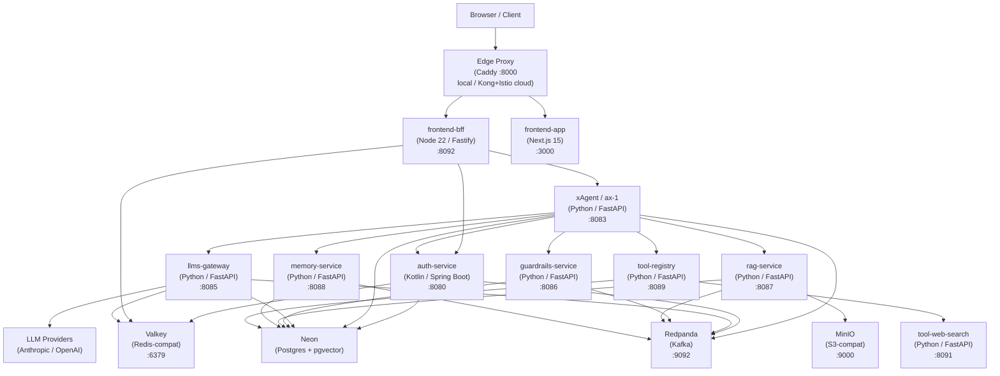

# 01 · Project Overview

## What is CypherX AI?

CypherX AI is a **multi-tenant, language-agnostic, agentic platform** for building, deploying, and orchestrating intelligent agents. Agents run in isolation or are combined through an orchestrator. The platform is purpose-built for enterprises that need:

- Strict tenant isolation (row-level security, no data bleed between customers)
- Contract-first service design (immutable cross-service contracts enforced in CI)
- Observable, metered AI workloads (every token counted, every request traced)
- Pluggable providers (swap Anthropic ↔ OpenAI without changing calling code)

---

## Problem Being Solved

| Pain | CypherX Answer |
|------|---------------|
| Every team builds its own LLM wrapper | One normalized gateway (`llms-gateway`) is the only path to any provider |
| No audit trail for AI decisions | Every guardrail check, LLM call, and task step persists in Postgres + Kafka |
| Cross-tenant data leakage in shared AI systems | Postgres RLS enforced at DB level; application code cannot bypass it |
| Provider lock-in | `llms-gateway` normalizes to an OpenAI-superset schema; swap provider in config |
| Silent prompt injection / harmful content | Mandatory guardrails service gates every input and output |
| No billing visibility | Per-call token metering with `llm_call_id` deduplication feeds billing system |

---

## Goals

1. **First-cycle spine** — prove end-to-end: _agent registered → JWT issued → task submitted → guardrails checked → LLM called → response returned, observable end-to-end_.
2. **Enterprise wave** — add RAG retrieval, long-term memory, tool invocation, A2A multi-agent orchestration, and full admin console.
3. **SaaS products** — Auth, LLMs, Guardrails, Memory, RAG are each a standalone SaaS product beyond this platform.

---

## Scope (First Cycle)

**In scope:**
- Agent identity and JWT issuance (auth-service)
- Unified LLM gateway with metering (llms-gateway)
- Input/output safety filter (guardrails-service)
- Single-agent task runtime (xAgent/ax-1)
- RAG knowledge-base retrieval (rag-service) — coded, flag-disabled
- Long-term agent memory (memory-service) — coded, flag-disabled
- MCP tool registry + web-search tool — coded, flag-disabled
- Admin console SPA + BFF
- Full observability (tracing, metrics, structured logs)
- Docker Compose local stack + Neon (serverless Postgres)

**Out of scope (first cycle):**
- A2A delegation and multi-agent orchestration (ax-2, Phase 10)
- Platform control plane / cost roll-up (platform/, Phase 11)
- Skills system (Phase 8)
- Cloud hardening: Kong, Istio, production ArgoCD promotion

---

## Key Features

| Feature | Description |
|---------|-------------|
| **Contract-First** | 21 immutable cross-service contracts (JSON Schema + OpenAPI) gated in CI |
| **Multi-Tenant** | Postgres RLS on every tenant-scoped table; tenants are isolated at DB level |
| **Unified LLM Gateway** | One `POST /v1/chat/completions` endpoint; normalizes Anthropic + OpenAI |
| **BYOK** | Bring-your-own-key per provider per tenant; falls back to platform keys |
| **Guardrails-as-a-Service** | 11 built-in rules + custom policies; HMAC redaction; cascading input/output filter |
| **Agent Memory** | Principal-scoped pgvector memory with GDPR wipe |
| **RAG** | Knowledge bases with pgvector semantic retrieval; async ingest via Kafka worker |
| **MCP Tools** | Pluggable stateless tool servers; tool-registry for discovery |
| **A2A Protocol** | Contract-3 task request/response; extensible to multi-agent later |
| **Transactional Outbox** | All Kafka events emitted atomically with domain mutations; no event loss |
| **Full Observability** | W3C trace propagation, structured JSON logs (Contract 6), Prometheus metrics (Contract 7) |
| **Keyless Local Dev** | `MOCK_PROVIDERS=true` runs the entire stack without any API keys |

---

## Technology Stack

| Layer | Technology |
|-------|-----------|
| **Auth service** | Kotlin 2, Spring Boot 3.3, JDK 21, Gradle KTS, Nimbus JOSE (RS256), Argon2id |
| **Python services** | Python 3.12, FastAPI, uv (dependency manager), psycopg3, aiokafka |
| **Frontend** | Next.js 15, React 19, TypeScript (SPA); Node 22, Fastify 4 (BFF) |
| **Database** | Neon (serverless Postgres + pgvector); RLS via `app.tenant_id` |
| **Migrations** | Atlas (HCL + SQL); versioned, idempotent |
| **Message broker** | Redpanda (Kafka-compatible); transactional outbox pattern |
| **Cache / session** | Valkey (Redis-compatible); AES-256-GCM encrypted sessions |
| **Object storage** | MinIO (S3-compatible) — RAG document storage |
| **Edge / local proxy** | Caddy (compose); Kong + Istio (cloud) |
| **Container runtime** | Docker Compose v2 (local); Kubernetes EKS (cloud) |
| **IaC** | Terraform + Terragrunt (AWS); Helm 3 (chart: `cypherx-service`) |
| **GitOps** | ArgoCD App-of-Apps; dev/staging auto-merge, prod manual-sync |
| **Secrets** | Doppler (synced to K8s Secrets in cloud) |
| **Observability** | OpenTelemetry, Tempo, Loki, Prometheus, Grafana |

---

## High-Level Architecture Diagram



> **Reading the diagram:** The Browser hits a single edge entry point. The BFF holds the session and injects auth headers. xAgent is the central agent runtime — it calls Auth (JWT verify), Guardrails (input/output), LLMs (inference), and optionally RAG/Memory/Tools. All services write events to Kafka and state to Neon.

---

## Project Structure

```
Cypher/
├── contracts/          # Single source of truth: 21 cross-service contracts (JSON Schema, OpenAPI)
├── archive/            # Planning specs: phase-00..14, enterprise flow, amendments
├── infra/              # Terraform IaC, Docker Compose stack, Tilt/kind local dev
├── charts/             # Helm base chart (cypherx-service) + example
├── gitops/             # ArgoCD App-of-Apps YAML
├── Shared Core/
│   ├── auth/           # Kotlin — agent identity, JWT, OIDC, API keys
│   ├── llms/           # Python — unified LLM gateway, metering, BYOK
│   ├── guardrails/     # Python — safety filter (input/output)
│   ├── rag/            # Python — RAG knowledge bases, pgvector
│   └── memory/         # Python — principal-scoped memory, pgvector
├── Tools/
│   ├── tool-registry/  # Python — MCP tool catalogue & health polling
│   └── tool-web-search/ # Python — stateless MCP web-search server
├── xAgent/
│   ├── ax-1/           # Python — single-agent runtime (Phase 9A)
│   └── ax-2/           # (empty) — A2A router + orchestrator (Phase 10)
├── frontend/           # Next.js SPA + Fastify BFF + stdlib demo
├── platform/           # (stub) — control plane (Phase 11)
├── CoreProjects/
│   └── cypherx-a1/     # Python — Autonomous Engineering Memory (consuming app)
├── Skills/             # (empty directory) — Phase 8, not yet built
└── docs/               # ← YOU ARE HERE
```

---

## Glossary

| Term | Definition |
|------|-----------|
| **A2A** | Agent-to-Agent protocol — Contract-3 task request/response format |
| **MCP** | Model Context Protocol — tool manifest + `POST /mcp/v1/invoke` invocation pattern |
| **Contract** | Immutable JSON Schema or OpenAPI definition shared across services; `contracts/` is the only source |
| **Tenant** | An isolated organizational unit; identified by a UUID; enforced at DB level via RLS |
| **Agent** | An autonomous software entity that has a registered identity (JWT) and can execute tasks |
| **BYOK** | Bring-Your-Own-Key — tenant supplies their own LLM provider API key |
| **xAgent** | The single-agent runtime (ax-1) that executes the task stage pipeline |
| **Outbox** | A DB table written in the same transaction as domain state; a relay publishes its rows to Kafka |
| **RLS** | Row-Level Security — Postgres feature that enforces tenant isolation at the database engine level |
| **Spine** | First-cycle end-to-end path: agent registered → JWT → task → guardrails → LLM → response |
| **WP** | Work Package — a numbered unit of implementation work (WP01–WP14) |
| **JWKS** | JSON Web Key Set — public key endpoint consumed by all services for JWT verification |
| **llm_call_id** | Gateway-minted UUID that uniquely identifies one LLM call for billing deduplication |
| **traceparent** | W3C trace context header; propagated through every inter-service call and Kafka event |
| **edge** | The single local entrypoint (Caddy container on :8000); maps to Kong+Istio in cloud |
| **px0** | External billing/identity system for end-user management (outside CypherX scope) |
