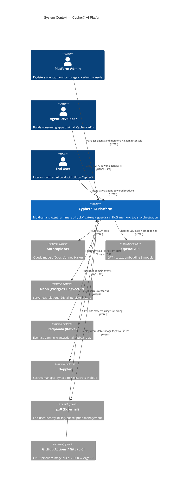
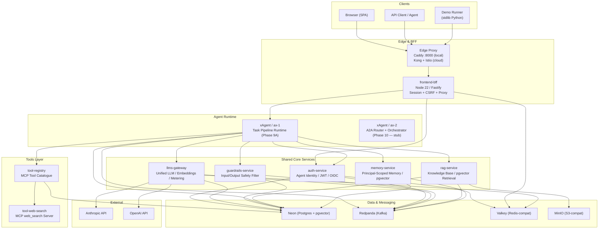
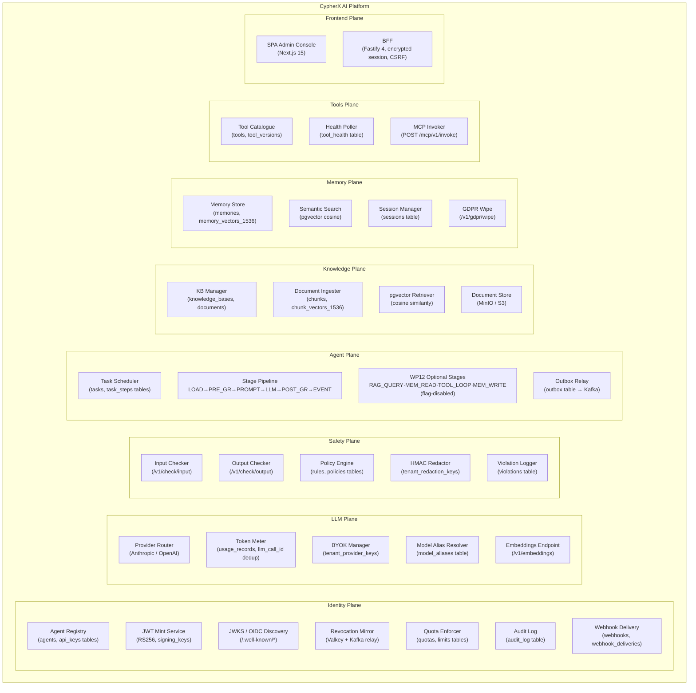
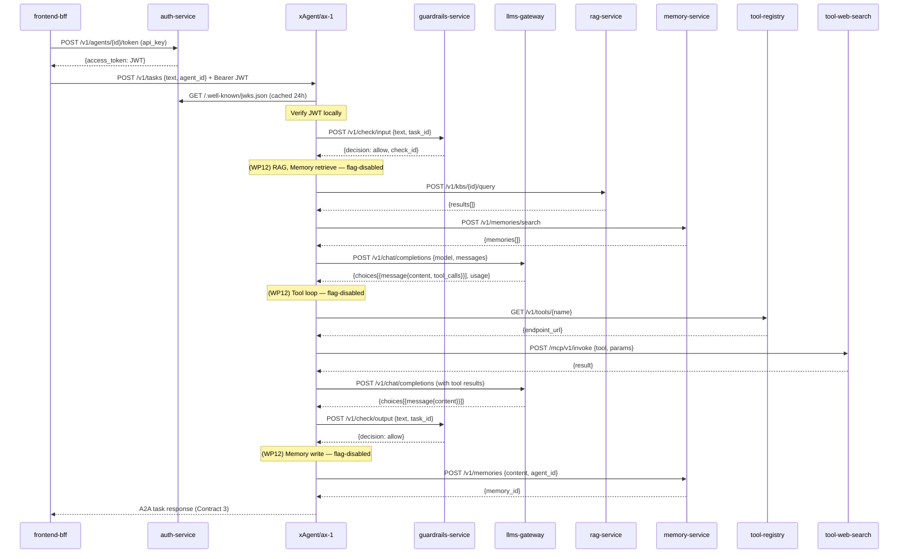
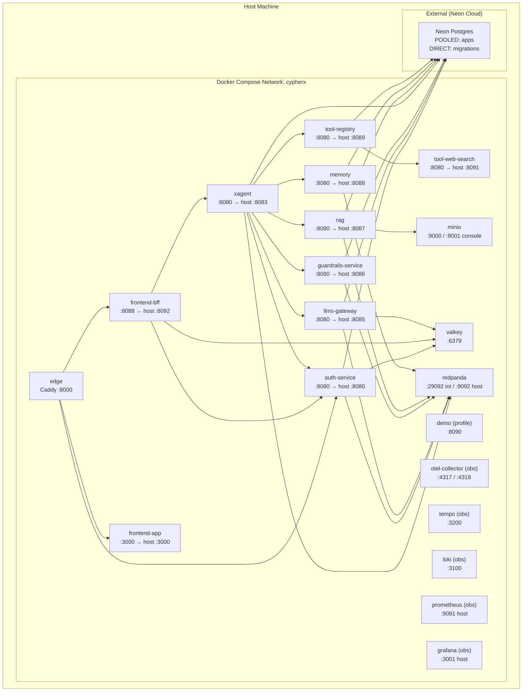
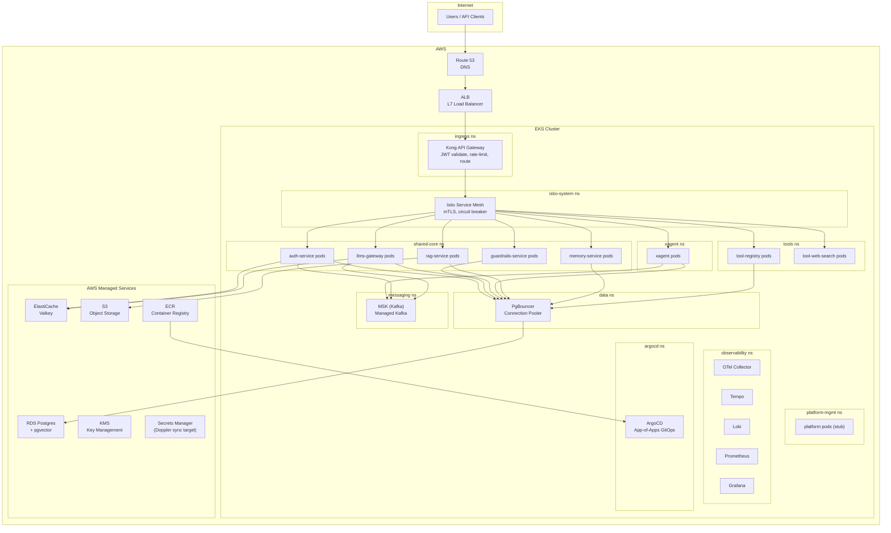
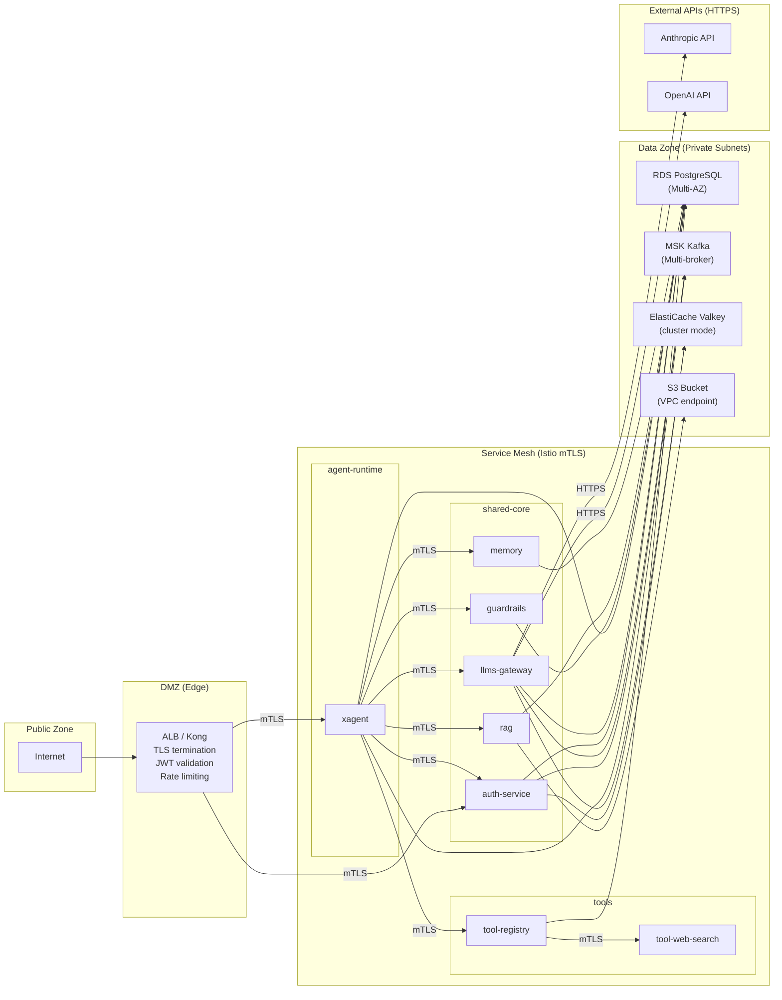
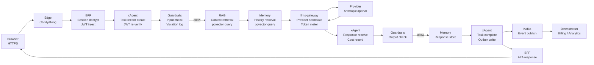
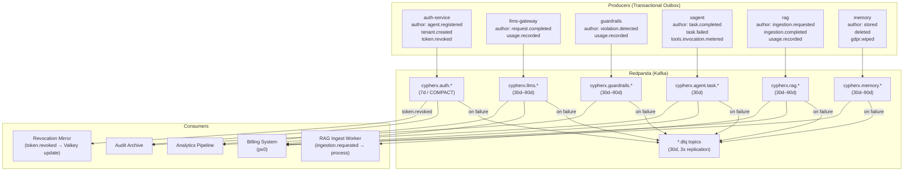

# 03 · Architecture

## 3.1 System Context Diagram

Shows the full system boundary: who uses CypherX and what external systems it depends on.

---

## 3.2 High-Level Architecture

The platform has four logical tiers:

---

## 3.3 Component Diagram

Internal decomposition of the platform into logical components.

---

## 3.4 Service Interaction Diagram

How services call each other during a task execution.

---

## 3.5 Deployment Diagram — Local Compose Stack

---

## 3.6 Deployment Diagram — Cloud / Kubernetes (AWS EKS)

---

## 3.7 Network Diagram

---

## 3.8 Data Flow Diagram

How data flows through the system from a task submission.

---

## 3.9 Event Flow Diagram

---

## 3.10 Architecture Decisions

Full ADR index: [15 · ADRs](../15-adrs/README.md)

| ADR | Decision |
|-----|---------|
| [ADR-001](../15-adrs/ADR-001-postgresql.md) | PostgreSQL as the primary database |
| [ADR-002](../15-adrs/ADR-002-kafka.md) | Kafka (Redpanda) for event streaming |
| [ADR-003](../15-adrs/ADR-003-kong-istio.md) | Kong + Istio for cloud API gateway and service mesh |
| [ADR-004](../15-adrs/ADR-004-jwt-rs256.md) | RS256 JWT for authentication (not HS256) |
| [ADR-005](../15-adrs/ADR-005-multi-tenant-rls.md) | Postgres RLS for multi-tenant isolation |
| [ADR-006](../15-adrs/ADR-006-contract-first.md) | Contract-first design with immutable versioning |
| [ADR-007](../15-adrs/ADR-007-transactional-outbox.md) | Transactional outbox pattern for Kafka reliability |
| [ADR-008](../15-adrs/ADR-008-openai-schema.md) | OpenAI-superset schema as the LLM gateway wire format |
| [ADR-009](../15-adrs/ADR-009-neon-serverless.md) | Neon serverless Postgres for local + staging DB |
| [ADR-010](../15-adrs/ADR-010-python-fastapi.md) | Python + FastAPI for all non-auth services |
