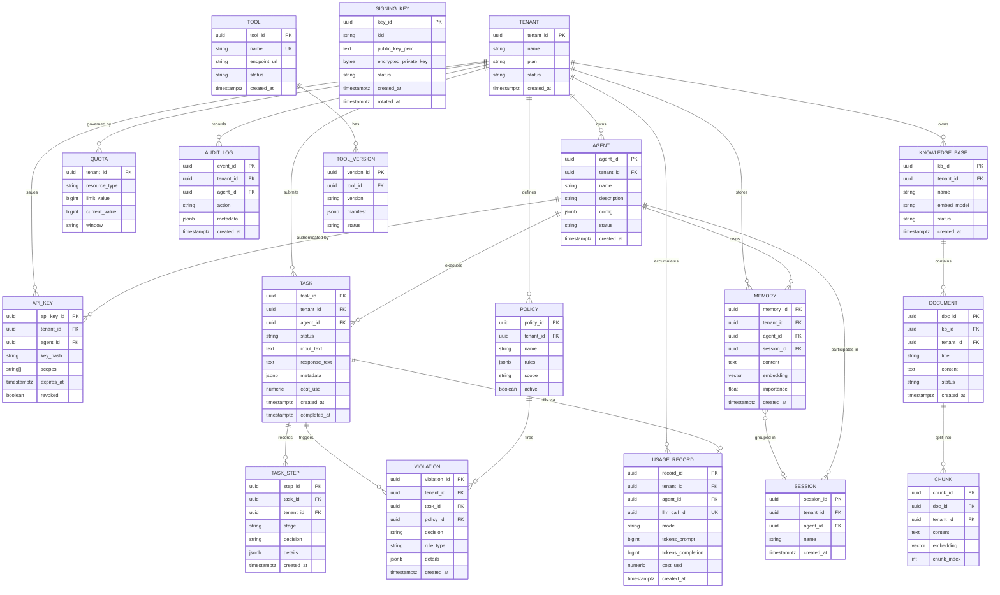

# 04 · Domain Model

## Core Concepts

| Concept | Definition |
|---------|-----------|
| **Tenant** | The top-level organizational unit. All data is isolated per tenant via Postgres RLS. |
| **Agent** | A registered software entity with a unique identity, scopes, and configuration. Agents submit tasks. |
| **Task** | A unit of work submitted to xAgent. Has a stage pipeline execution record and a final result. |
| **API Key** | A long-lived credential (Argon2id-hashed) that maps to an agent. Exchanged for a JWT at runtime. |
| **JWT** | A short-lived (≤3600s) RS256-signed token asserting an agent's identity and scopes. |
| **Service Token** | A short-lived (300s) RS256 token for internal service-to-service communication (Contract 12). |
| **Signing Key** | An RSA-2048+ key pair used to mint JWTs. Stored envelope-encrypted in auth DB. Rotated every 90 days. |
| **Knowledge Base** | A tenant-scoped collection of documents indexed in pgvector for semantic retrieval (RAG). |
| **Memory** | A persisted text fragment associated with a principal (agent + tenant) and optionally a session. |
| **Session** | A grouping of related memories for a conversation or work session. |
| **Tool** | A registered MCP server capability that xAgent can invoke during task execution. |
| **Policy** | A tenant-defined set of guardrail rules applied in cascade to all inputs and outputs. |
| **Violation** | A recorded event when a guardrail rule fires (warn or block decision). |
| **Quota** | Per-tenant limits on tokens/month, requests/day, etc. Enforced at the auth and LLMs level. |
| **Usage Record** | An immutable billing row recording tokens consumed, cost in USD, and the model used. |
| **Outbox** | A per-service DB table that stores Kafka events atomically with domain state. A relay publishes them. |

---

## Entities & Relationships

---

## Business Rules

### Identity Rules
1. An agent belongs to exactly one tenant; it cannot be moved between tenants.
2. An agent JWT's `tenant_id` claim MUST match the tenant that owns the agent — auth-service enforces this at mint time.
3. API keys are single-use-per-call (exchanged for a JWT at each use); the underlying key is stored as an Argon2id hash only.
4. Signing keys rotate every 90 days. During rotation, the new key is used for minting; the old key remains in JWKS for 24h for in-flight tokens.
5. JWT revocation is immediate: a revoked JTI is written to `auth.revoked_tokens` and broadcast via Kafka; the Valkey mirror is consulted within the 24h cache TTL.

### Task Rules
6. A task is immutable once in `completed` or `failed` status. No re-runs; submit a new task.
7. The `PRE_GUARDRAIL` stage is mandatory; it cannot be skipped even if the guardrails service is degraded (timeout → task fails with `GUARDRAIL_TIMEOUT`).
8. If any guardrail stage returns `block`, the task is failed with `GUARDRAIL_VIOLATION` (422); the LLM is never called.
9. The `llm_call_id` is minted by the gateway, not the caller. It is the authoritative key for billing deduplication.
10. A task submitted with an `Idempotency-Key` that already exists within 24h returns the cached response with `Idempotent-Replayed: true`.

### Data Isolation Rules
11. Every tenant-scoped table has RLS enforced via `SET LOCAL app.tenant_id`. Services set this at the start of every request handler.
12. The platform tenant (`00000000-0000-0000-0000-000000000001`) is readable by all services but writable only by tokens carrying `platform:admin` scope.
13. Cross-tenant data access is architecturally impossible: service roles are non-BYPASSRLS; no service holds superuser privileges.

### Memory & RAG Rules
14. Memory embeddings are generated via llms-gateway; if the gateway is unavailable, the mock fallback is used and `is_mock=true` is flagged on the record.
15. A GDPR wipe (`DELETE /v1/gdpr/wipe`) deletes ALL memories for a principal and emits `cypherx.memory.gdpr.wiped` to Kafka. This is irreversible.
16. KB documents are chunked and embedded asynchronously; a document is not queryable until its status transitions to `indexed`.

### Billing Rules
17. Usage records are inserted with a UNIQUE constraint on `(tenant_id, llm_call_id)`. Retry-safe: idempotent inserts silently succeed.
18. Cost in USD is computed at the gateway using the provider's token pricing table. The gateway is the single source of billing truth.
19. Quota enforcement uses a sliding-window counter in Valkey. Exceeding the quota returns 429 `QUOTA_EXCEEDED` before any LLM call is made.

### Guardrail Rules
20. Guardrail policies are evaluated in precedence order (system defaults → platform defaults → tenant overrides → agent overrides).
21. The `redact` decision replaces matched patterns with HMAC-keyed deterministic tokens (reversible by the tenant with their redaction key).
22. A `warn` decision logs the violation but continues processing; the caller receives a `X-Guardrail-Warnings` response header.

---

## Domain Events

| Event | Trigger | Key Fields |
|-------|---------|-----------|
| `agent.registered` | New agent created in auth | `agent_id, tenant_id, scopes` |
| `tenant.created` | New tenant provisioned | `tenant_id, plan` |
| `token.revoked` | JWT or API key revoked | `jti, agent_id, tenant_id, reason` |
| `task.completed` | xAgent finishes task successfully | `task_id, agent_id, tenant_id, cost_usd, steps[]` |
| `task.failed` | xAgent fails a task | `task_id, agent_id, error_code, reason` |
| `llms.request.completed` | LLM call finishes | `llm_call_id, model, tokens_prompt, tokens_completion, cost_usd` |
| `guardrails.violation.detected` | Guardrail fires warn/block | `task_id, rule_type, decision, check_id` |
| `memory.stored` | Memory written | `memory_id, agent_id, session_id` |
| `memory.gdpr.wiped` | GDPR wipe executed | `principal_id, tenant_id, count_deleted` |
| `rag.ingestion.completed` | Document indexed | `doc_id, kb_id, chunk_count` |
