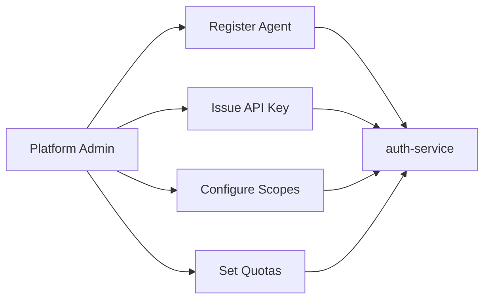
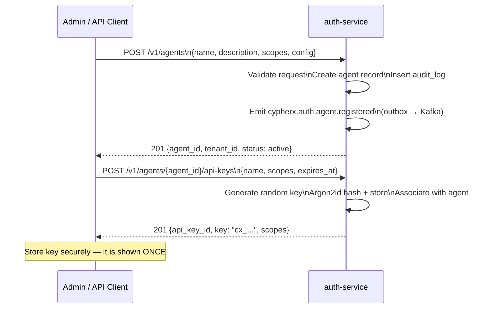
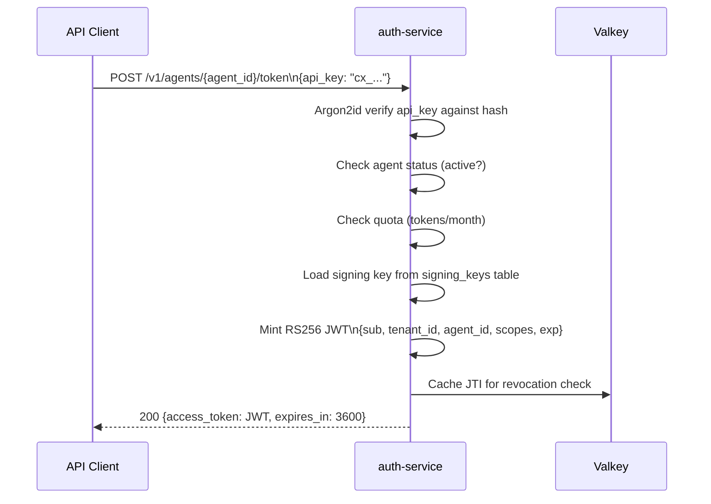
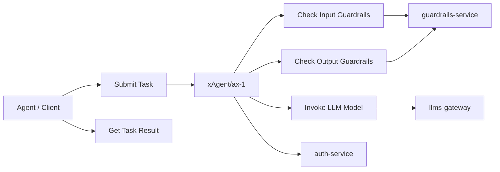
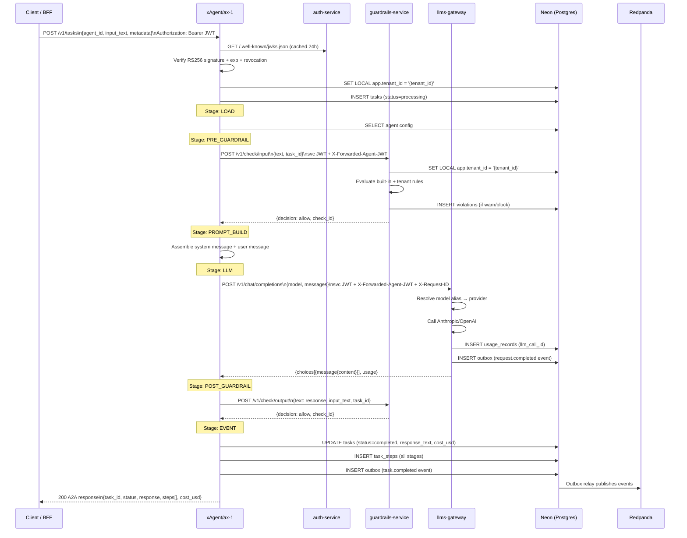
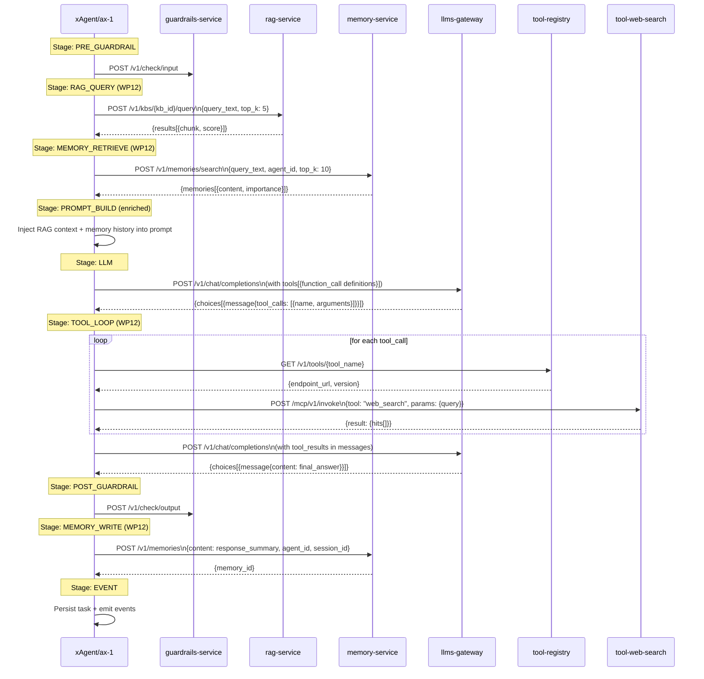
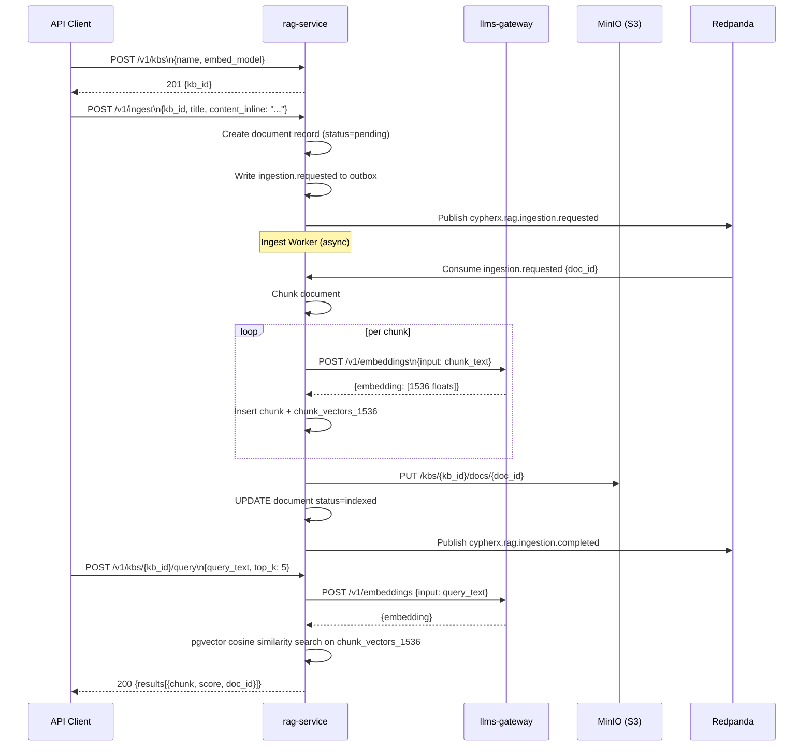
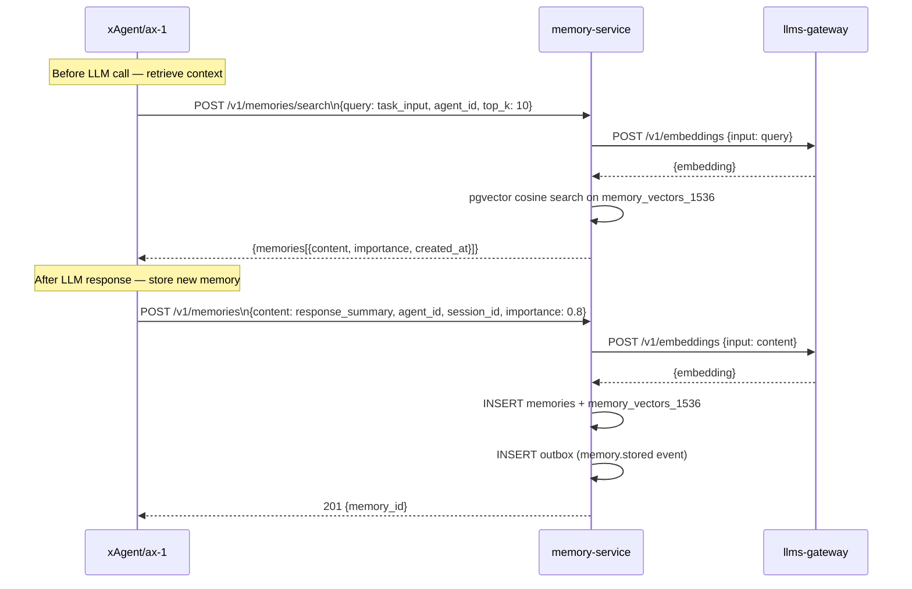
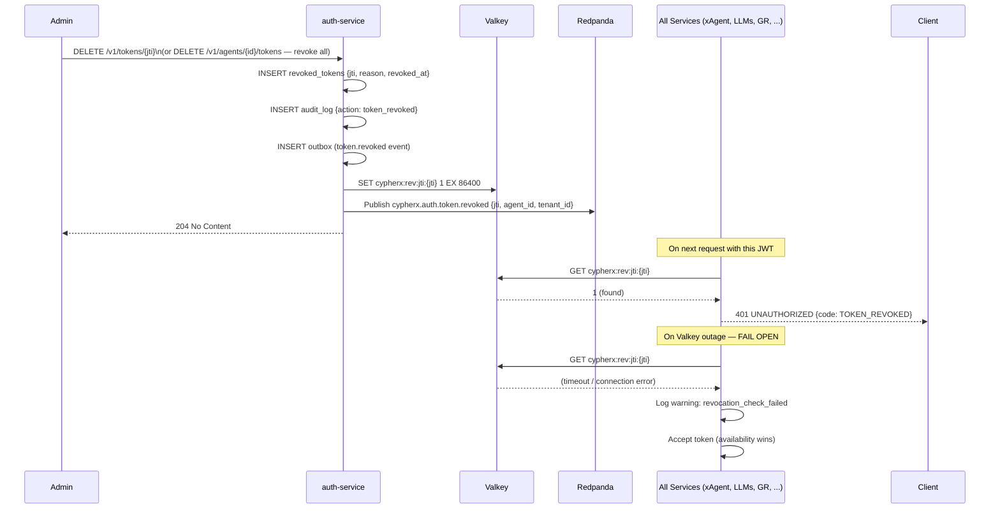

# 05 · Workflows

## Workflow Index

| # | Workflow | Entry Point |
|---|---------|-------------|
| [5.1](#51-agent-registration) | Agent Registration | POST /v1/agents |
| [5.2](#52-api-key-issuance--login) | API Key Issuance & Login | POST /v1/agents/{id}/api-keys → /v1/agents/{id}/token |
| [5.3](#53-admin-console-login) | Admin Console Login | Browser → BFF → Auth |
| [5.4](#54-agent-task-execution-first-cycle-spine) | Agent Task Execution (Spine) | POST /v1/tasks |
| [5.5](#55-agent-task-execution-wp12-enhanced) | Agent Task Execution (WP12 Enhanced) | POST /v1/tasks + RAG/Memory/Tools |
| [5.6](#56-rag-knowledge-base-ingestion) | RAG Knowledge Base Ingestion | POST /v1/kbs + POST /v1/ingest |
| [5.7](#57-memory-retrieval--storage) | Memory Retrieval & Storage | POST /v1/memories/search + POST /v1/memories |
| [5.8](#58-token-revocation) | Token Revocation | DELETE /v1/tokens/{jti} |

---

## 5.1 Agent Registration

### Overview
An admin or API client registers a new agent under a tenant. This creates the agent record, issues an API key, and seeds the agent's initial configuration.

### Use Case Diagram


### Sequence Diagram


### Flow Steps
1. Admin sends `POST /v1/agents` with `Authorization: Bearer <platform_admin_jwt>`.
2. auth-service validates the JWT, confirms `platform:admin` scope.
3. Agent record is created with `status=active`.
4. An `audit_log` entry records the registration action.
5. `cypherx.auth.agent.registered` is written to the outbox and published to Kafka.
6. Admin issues API keys via `POST /v1/agents/{id}/api-keys`.
7. The raw API key is returned **once** (Argon2id hash stored; original never retrievable).

### Failure Paths
- `403 FORBIDDEN` — caller JWT lacks `platform:admin` scope.
- `409 CONFLICT` — agent name already exists in the tenant.
- `429 QUOTA_EXCEEDED` — tenant has reached max agent count.

---

## 5.2 API Key Issuance & Login

### Sequence Diagram


### Notes
- The JWT is valid for ≤3600s (configurable per plan).
- Clients should cache the JWT and re-mint only when it nears expiry.
- API key exchange is rate-limited per agent to prevent brute-force.

---

## 5.3 Admin Console Login

### Overview
The browser-based admin console uses the BFF as a security boundary. The SPA never holds tokens.

### Sequence Diagram
```mermaid
sequenceDiagram
    participant Browser as Browser (SPA)
    participant Edge as Edge (Caddy)
    participant BFF as frontend-bff
    participant Auth as auth-service
    participant Valkey as Valkey

    Browser->>Edge: GET / (SPA load)
    Edge-->>Browser: HTML + JS bundle

    Browser->>BFF: POST /bff/login\n{agent_id, api_key}\n(no token yet — permit-all route)
    BFF->>Auth: POST /v1/agents/{agent_id}/token\n{api_key}
    Auth-->>BFF: {access_token: JWT}
    BFF->>Valkey: AES-256-GCM encrypt session\nStore {jwt, tenant_id, csrf_token}\nKey: session_id UUID
    BFF-->>Browser: Set-Cookie: session=<session_id>; HttpOnly; Secure; SameSite=Lax\nSet-Cookie: cypherx_csrf=<csrf_token>; SameSite=Lax\n200 {tenant_id, agent_id}

    Browser->>BFF: GET /bff/me\n(Cookie: session=<session_id>)
    BFF->>Valkey: Decrypt session → {jwt, tenant_id}
    BFF-->>Browser: 200 {agent_id, tenant_id, scopes, plan}
```

### CSRF Flow
```mermaid
sequenceDiagram
    participant Browser as Browser
    participant BFF as frontend-bff

    Browser->>BFF: POST /bff/api/tasks\nX-CSRF-Token: <value from cypherx_csrf cookie>\nCookie: session=...; cypherx_csrf=<value>
    BFF->>BFF: Assert X-CSRF-Token header == cypherx_csrf cookie == session.csrfToken
    Note over BFF: All three must match — double-submit + session binding
    BFF->>BFF: Decrypt session → JWT
    BFF->>BFF: Inject Bearer JWT, X-Tenant-ID, traceparent
    BFF->>BFF: Strip all client-supplied Authorization / X-Tenant-ID headers
    BFF->>xAgent: POST /v1/tasks (proxied with injected headers)
```

---

## 5.4 Agent Task Execution (First-Cycle Spine)

### Overview
The minimum viable task flow: JWT verification → guardrails → LLM → guardrails → response.

### Use Case Diagram


### Sequence Diagram


### Success Path
1. `201` on `POST /v1/tasks` → `task_id` returned immediately if async, or full response if sync.
2. Task visible via `GET /v1/tasks/{task_id}`.
3. Two Kafka events emitted: `cypherx.llms.request.completed` + `cypherx.agent.task.completed`.

### Failure Paths
| Error | HTTP | Code | Cause |
|-------|------|------|-------|
| Invalid JWT | 401 | `UNAUTHORIZED` | Expired, bad signature, revoked |
| Quota exceeded | 429 | `QUOTA_EXCEEDED` | Tenant hit token or request limit |
| Input guardrail block | 422 | `GUARDRAIL_VIOLATION` | Pre-guardrail returns block |
| Output guardrail block | 422 | `GUARDRAIL_VIOLATION` | Post-guardrail returns block |
| LLM provider error | 502 | `PROVIDER_ERROR` | Provider 5xx or timeout |
| Idempotency conflict | 409 | `IDEMPOTENCY_CONFLICT` | Same key within 24h with different body |

---

## 5.5 Agent Task Execution (WP12 Enhanced)

WP12 stages are built into xAgent but disabled by default (`STAGE_ENABLE_RAG_QUERY`, `STAGE_ENABLE_MEMORY_RETRIEVE`, `STAGE_ENABLE_TOOL_LOOP`, `STAGE_ENABLE_MEMORY_WRITE`).

### Sequence Diagram (with all WP12 stages enabled)


---

## 5.6 RAG Knowledge Base Ingestion

### Sequence Diagram


---

## 5.7 Memory Retrieval & Storage

### Sequence Diagram


---

## 5.8 Token Revocation

### Sequence Diagram

