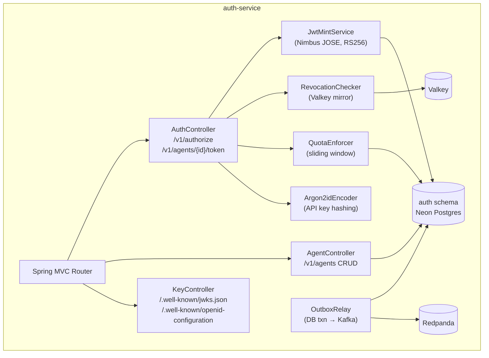
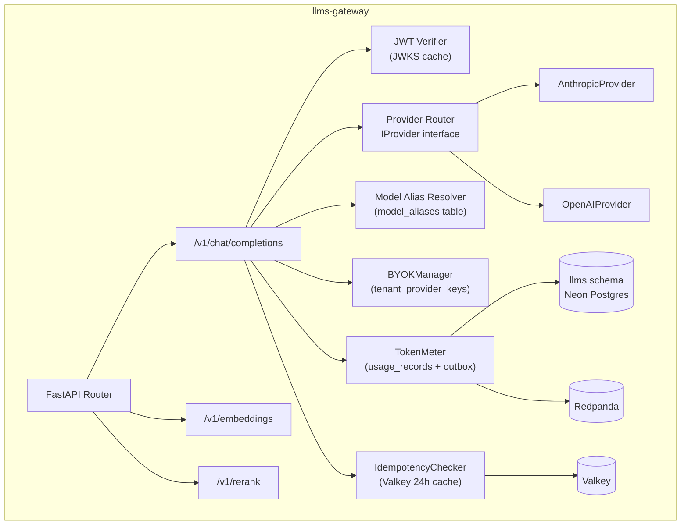
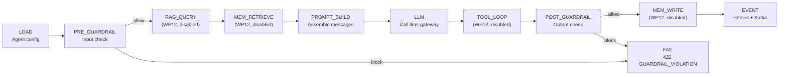
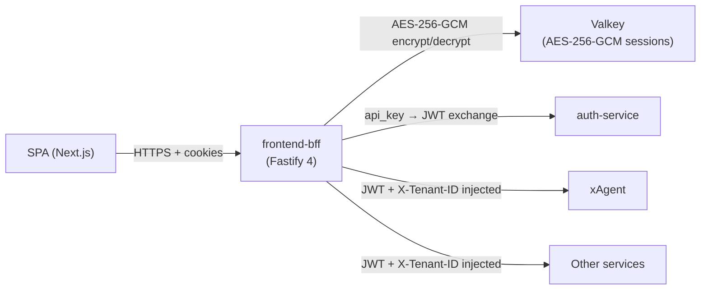

# 06 · Services

## Service Catalog

| Service | Language | Port (host) | Status | Details |
|---------|----------|-------------|--------|---------|
| [auth-service](#auth-service) | Kotlin 2 / Spring Boot 3.3 | 8080 | ✅ Implemented | [Details](#auth-service) |
| [llms-gateway](#llms-gateway) | Python 3.12 / FastAPI | 8085 | ✅ Implemented | [Details](#llms-gateway) |
| [guardrails-service](#guardrails-service) | Python 3.12 / FastAPI | 8086 | ✅ Implemented | [Details](#guardrails-service) |
| [xAgent / ax-1](#xagent--ax-1) | Python 3.12 / FastAPI | 8083 | ✅ Implemented | [Details](#xagent--ax-1) |
| [rag-service](#rag-service) | Python 3.12 / FastAPI | 8087 | ✅ Implemented | [Details](#rag-service) |
| [memory-service](#memory-service) | Python 3.12 / FastAPI | 8088 | ✅ Implemented | [Details](#memory-service) |
| [tool-registry](#tool-registry) | Python 3.12 / FastAPI | 8089 | ✅ Implemented | [Details](#tool-registry) |
| [tool-web-search](#tool-web-search) | Python 3.12 / FastAPI | 8091 | ✅ Implemented | [Details](#tool-web-search) |
| [frontend-bff](#frontend-bff) | Node 22 / Fastify 4 | 8092 | ✅ Implemented | [Details](#frontend-bff) |
| [frontend-app](#frontend-app) | Next.js 15 / React 19 | 3000 | ✅ Implemented | [Details](#frontend-app) |
| [xAgent / ax-2](#xagent--ax-2) | TBD | — | 🔲 Empty | [Details](#xagent--ax-2) |
| [platform](#platform) | Kotlin (planned) | — | 🔲 Stub | [Details](#platform) |

---

## auth-service

### Overview
The identity and access management core of the platform. It authenticates agents (not end-users), issues JWTs, manages API keys, enforces quotas, and provides JWKS + OIDC discovery.

### Architecture Diagram

### Responsibilities
- Register, update, suspend, and delete agents
- Issue agent JWTs (RS256, ≤3600s TTL) and service tokens (RS256, 300s TTL)
- Issue and verify API keys (Argon2id hash stored; key shown once)
- Expose JWKS (`/.well-known/jwks.json`) and OIDC discovery
- Enforce per-tenant quotas (token budget, request rate)
- Revoke JWTs and API keys; broadcast via Kafka
- Rotate signing keys (every 90 days); keep old keys in JWKS for 24h
- Write structured audit log for every sensitive action
- Deliver tenant webhooks (async outbox-based worker)

### NOT Responsibilities
- End-user identity (that is `px0`)
- Session management (that is the BFF)
- LLM token counting (that is llms-gateway)

### Key APIs

| Method | Path | Description |
|--------|------|-------------|
| POST | `/v1/agents` | Register agent |
| GET | `/v1/agents/{id}` | Get agent details |
| PUT | `/v1/agents/{id}` | Update agent config |
| DELETE | `/v1/agents/{id}` | Delete agent |
| POST | `/v1/agents/{id}/token` | Exchange API key → JWT |
| POST | `/v1/agents/{id}/api-keys` | Issue API key |
| DELETE | `/v1/agents/{id}/api-keys/{keyId}` | Revoke API key |
| GET | `/.well-known/jwks.json` | Public JWKS |
| GET | `/.well-known/openid-configuration` | OIDC discovery |
| GET | `/v1/tenants/{id}/quotas` | Get quota usage |
| PUT | `/v1/tenants/{id}/quotas` | Update quota limits |
| GET | `/livez` | Liveness probe |
| GET | `/readyz` | Readiness probe |
| GET | `/metrics` | Prometheus metrics |

### Database Tables (schema: `auth`)
| Table | Purpose |
|-------|---------|
| `tenants` | Tenant records with plan, status |
| `agents` | Agent records with config, scopes |
| `api_keys` | API key hashes, associated agent, scopes, expiry |
| `signing_keys` | RSA key pairs (envelope-encrypted private keys) |
| `revoked_tokens` | JTI revocation list |
| `quotas` | Per-tenant resource limits |
| `quota_usage` | Per-tenant usage counters |
| `audit_log` | Immutable audit trail |
| `service_acl` | Allowed service-to-service calls |
| `outbox` | Transactional event outbox |
| `webhooks` | Registered webhook endpoints |
| `webhook_deliveries` | Delivery attempts + status |

### Events Produced
| Topic | Trigger |
|-------|---------|
| `cypherx.auth.agent.registered` | New agent created |
| `cypherx.auth.agent.updated` | Agent config changed |
| `cypherx.auth.token.revoked` | JWT or API key revoked |
| `cypherx.auth.policy.changed` | Policy mutated |
| `cypherx.auth.quota.changed` | Quota limit updated |
| `cypherx.tenant.created` | New tenant provisioned |
| `cypherx.tenant.suspended` | Tenant suspended |
| `cypherx.tenant.plan_changed` | Plan upgraded/downgraded |

### Scaling Strategy
- Horizontal: stateless (signing keys in DB, revocation in Valkey); add replicas freely.
- Argon2id is the CPU bottleneck on password/key-verify paths — dedicated auth pods recommended.

---

## llms-gateway

### Overview
The single choke point for all LLM traffic. Normalizes one OpenAI-superset request schema to Anthropic or OpenAI providers, meters tokens, and supports BYOK.

### Architecture Diagram

### Responsibilities
- Accept `POST /v1/chat/completions` in OpenAI superset format
- Resolve model alias to provider + model name via `model_aliases` DB table
- Normalize request → Anthropic Messages API or OpenAI Chat Completions API
- Normalize response → consistent `choices[{message{content, tool_calls}, finish_reason}]` schema
- Meter every token (prompt, completion, cache) and compute cost_usd
- Emit `cypherx.llms.request.completed` + `cypherx.llms.usage.recorded` atomically
- Support BYOK: prefer tenant's registered provider key over platform key
- Support streaming (`stream: true`) via SSE passthrough
- Check idempotency (24h Valkey cache keyed by `Idempotency-Key` + tenant)

### Key APIs

| Method | Path | Description |
|--------|------|-------------|
| POST | `/v1/chat/completions` | LLM inference (streaming or sync) |
| POST | `/v1/embeddings` | Text embeddings |
| POST | `/v1/rerank` | Rerank documents by relevance |
| POST | `/v1/classify` | Text classification |
| GET | `/v1/models` | List available model aliases |
| POST | `/v1/keys` | Register BYOK provider key |
| DELETE | `/v1/keys/{id}` | Remove BYOK key |
| GET | `/livez` | Liveness |
| GET | `/readyz` | Readiness |
| GET | `/metrics` | Prometheus |

### Database Tables (schema: `llms`)
| Table | Purpose |
|-------|---------|
| `usage_records` | Per-call billing rows; UNIQUE on `(tenant_id, llm_call_id)` |
| `model_aliases` | Maps alias (e.g., `fast`) to `provider:model_id` |
| `provider_pricing` | Token cost per model per provider |
| `tenant_provider_keys` | BYOK keys (encrypted) per tenant per provider |
| `outbox` | Kafka event outbox |

### Events Produced
| Topic | Trigger |
|-------|---------|
| `cypherx.llms.request.completed` | LLM call completes |
| `cypherx.llms.usage.recorded` | Usage metered |

---

## guardrails-service

### Overview
An input/output safety filter that runs as a mandatory stage in xAgent's pipeline. Evaluates requests against policy rules and returns a decision.

### Responsibilities
- Evaluate text against 11+ built-in rule types (prompt injection, PII, hate speech, jailbreak, toxic, etc.)
- Evaluate against tenant-defined custom policies
- Support decisions: `allow`, `warn`, `redact`, `block`
- HMAC-keyed redaction of matched PII patterns
- Log every `warn` or `block` decision to `violations` table
- Expose policy CRUD (`/v1/policies`)
- Expose simulation endpoint (`/v1/simulate`) for policy testing without side effects
- `CLASSIFIER_MODE`: `stub` (offline, default), `detoxify` (optional, torch-based)

### Key APIs

| Method | Path | Description |
|--------|------|-------------|
| POST | `/v1/check/input` | Evaluate input text |
| POST | `/v1/check/output` | Evaluate output text |
| GET | `/v1/policies` | List tenant policies |
| POST | `/v1/policies` | Create policy |
| PUT | `/v1/policies/{id}` | Update policy |
| DELETE | `/v1/policies/{id}` | Delete policy |
| POST | `/v1/simulate` | Test a policy without logging |
| GET | `/v1/violations` | List violations (audit) |
| GET | `/livez` | Liveness |
| GET | `/readyz` | Readiness |
| GET | `/metrics` | Prometheus |

### Database Tables (schema: `guardrails`)
| Table | Purpose |
|-------|---------|
| `rules` | Built-in + custom rule definitions |
| `policies` | Tenant policy sets (ordered rule chains) |
| `violations` | Recorded warn/block events |
| `tenant_redaction_keys` | Per-tenant HMAC keys for PII redaction |
| `policy_audit` | Policy change history |
| `outbox` | Kafka event outbox |

### Events Produced
| Topic | Trigger |
|-------|---------|
| `cypherx.guardrails.violation.detected` | Rule fires warn/block |
| `cypherx.guardrails.usage.recorded` | Check metered |

### SLOs
| Metric | p50 | p99 |
|--------|-----|-----|
| Input check | 30 ms | 50 ms |
| Output check | 60 ms | 100 ms |

---

## xAgent / ax-1

### Overview
The single-agent task runtime. Accepts task submissions, verifies the caller's JWT, runs the stage pipeline, and returns a Contract-3 A2A response.

### Stage Pipeline

### Key APIs

| Method | Path | Description |
|--------|------|-------------|
| POST | `/v1/tasks` | Submit task (sync or async) |
| GET | `/v1/tasks/{id}` | Get task status + result |
| GET | `/v1/tasks` | List tasks (tenant-scoped) |
| GET | `/v1/tasks/{id}/stream` | SSE streaming response |
| DELETE | `/v1/tasks/{id}` | Cancel task |
| GET | `/v1/agents/{id}/runtime` | Agent runtime config |
| GET | `/livez` | Liveness |
| GET | `/readyz` | Readiness |
| GET | `/metrics` | Prometheus |

### Database Tables (schema: `xagent`)
| Table | Purpose |
|-------|---------|
| `agents` | Per-tenant agent runtime cache (config snapshot) |
| `tasks` | Task records: status, input, response, cost |
| `task_steps` | Per-stage audit: stage, decision, check_id, timing |
| `outbox` | Kafka event outbox |

### Events Produced
| Topic | Trigger |
|-------|---------|
| `cypherx.agent.task.completed` | Task finishes successfully |
| `cypherx.agent.task.failed` | Task errors |
| `cypherx.agent.tools.invocation.metered` | Tool used (WP12) |

---

## rag-service

### Overview
Universal RAG (Retrieval-Augmented Generation) service. Provides knowledge bases, async document ingestion, and pgvector semantic retrieval.

### Key APIs

| Method | Path | Description |
|--------|------|-------------|
| POST | `/v1/kbs` | Create knowledge base |
| GET | `/v1/kbs` | List KBs (tenant-scoped) |
| GET | `/v1/kbs/{id}` | Get KB details |
| DELETE | `/v1/kbs/{id}` | Delete KB |
| POST | `/v1/ingest` | Ingest document |
| GET | `/v1/docs/{id}` | Get document status |
| DELETE | `/v1/docs/{id}` | Delete document |
| POST | `/v1/kbs/{id}/query` | Semantic similarity query |
| GET | `/livez` | Liveness |
| GET | `/readyz` | Readiness |
| GET | `/metrics` | Prometheus |

### Database Tables (schema: `rag`)
| Table | Purpose |
|-------|---------|
| `knowledge_bases` | KB metadata, embed model, status |
| `documents` | Document metadata, content hash, ingestion status |
| `chunks` | Text chunks with token counts |
| `chunk_vectors_1536` | pgvector embeddings (1536-dim) |
| `kb_acls` | KB access control per agent |
| `pricing` | KB query pricing |
| `outbox` | Kafka event outbox |

### Events Produced
| Topic | Trigger |
|-------|---------|
| `cypherx.rag.ingestion.requested` | Ingest work order |
| `cypherx.rag.ingestion.completed` | Document indexed |
| `cypherx.rag.usage.recorded` | KB query metered |

---

## memory-service

### Overview
Principal-scoped long-term memory for agents. Stores, searches (pgvector), and manages memories with session grouping and GDPR wipe.

### Key APIs

| Method | Path | Description |
|--------|------|-------------|
| POST | `/v1/memories` | Store memory |
| GET | `/v1/memories` | List memories (agent-scoped) |
| GET | `/v1/memories/{id}` | Get memory |
| DELETE | `/v1/memories/{id}` | Delete memory |
| POST | `/v1/memories/search` | Semantic search |
| POST | `/v1/sessions` | Create session |
| GET | `/v1/sessions` | List sessions |
| DELETE | `/v1/sessions/{id}` | Delete session + memories |
| DELETE | `/v1/gdpr/wipe` | GDPR bulk wipe |
| GET | `/livez` | Liveness |
| GET | `/readyz` | Readiness |
| GET | `/metrics` | Prometheus |

### Database Tables (schema: `memory`)
| Table | Purpose |
|-------|---------|
| `memories` | Memory records with importance score |
| `memory_vectors_1536` | pgvector embeddings |
| `sessions` | Session groupings |
| `gdpr_wipe_log` | GDPR audit trail |
| `pricing` | Memory operation pricing |
| `outbox` | Kafka event outbox |

### Events Produced
| Topic | Trigger |
|-------|---------|
| `cypherx.memory.stored` | Memory persisted |
| `cypherx.memory.deleted` | Memory deleted |
| `cypherx.memory.gdpr.wiped` | Bulk GDPR wipe |

---

## tool-registry

### Overview
Central MCP tool catalogue. Agents discover available tools and their versions. The registry health-polls registered tool servers.

### Key APIs

| Method | Path | Description |
|--------|------|-------------|
| GET | `/v1/tools` | List all tools |
| GET | `/v1/tools/{name}` | Get tool manifest |
| GET | `/v1/tools/{name}/versions` | List versions |
| POST | `/v1/tools` | Register tool server |
| PUT | `/v1/tools/{name}` | Update tool registration |
| DELETE | `/v1/tools/{name}` | Deregister tool |
| GET | `/v1/tools/{name}/health` | Current health status |
| GET | `/livez` | Liveness |
| GET | `/readyz` | Readiness |
| GET | `/metrics` | Prometheus |

### Database Tables (schema: `tools`)
| Table | Purpose |
|-------|---------|
| `tools` | Tool registration: name, endpoint_url, status |
| `tool_versions` | Per-version manifests |
| `tool_capabilities` | Declared capability tags |
| `tool_health` | Latest health poll result |
| `outbox` | Kafka event outbox |

---

## tool-web-search

### Overview
A stateless MCP tool server that implements the `web_search` tool. Invoked by xAgent via `POST /mcp/v1/invoke`. Supports mock, SerpAPI, and Brave Search providers.

### Key APIs

| Method | Path | Description |
|--------|------|-------------|
| GET | `/manifest` | MCP tool manifest |
| POST | `/mcp/v1/invoke` | Invoke `web_search` tool |
| GET | `/livez` | Liveness |
| GET | `/readyz` | Readiness |

### Configuration
| Env Var | Default | Description |
|---------|---------|-------------|
| `SEARCH_PROVIDER` | `mock` | `mock`, `serpapi`, `brave` |
| `SERPAPI_KEY` | — | SerpAPI key (if provider=serpapi) |
| `BRAVE_SEARCH_KEY` | — | Brave key (if provider=brave) |

---

## frontend-bff

### Overview
The Backend-For-Frontend (BFF) is the security boundary between the browser and all backend services. It holds the encrypted session, enforces CSRF, exchanges API keys for JWTs, and proxies all SPA calls.

### Architecture Diagram

### Key APIs

| Method | Path | Description |
|--------|------|-------------|
| POST | `/bff/login` | Exchange api_key → session (permit-all) |
| POST | `/bff/logout` | Destroy session |
| GET | `/bff/me` | Current agent info |
| * | `/bff/api/*` | Proxy to backend services (auth-required) |
| GET | `/healthz` | BFF health |

### Session Security Model
- Session ID stored in `httpOnly; Secure; SameSite=Lax` cookie.
- Session payload (JWT + tenant_id + csrf_token) AES-256-GCM encrypted in Valkey.
- CSRF: X-CSRF-Token header MUST equal both the `cypherx_csrf` cookie and `session.csrfToken`.
- The SPA never has access to the JWT — only the BFF can read it.

---

## frontend-app

### Overview
The Next.js 15 admin console SPA. Communicates only with the BFF.

### Pages
- `/` — Dashboard: task feed, usage charts
- `/agents` — Agent list + registration form
- `/agents/{id}` — Agent detail: config, task history, memory
- `/kbs` — Knowledge base list + ingestion UI
- `/settings` — Tenant settings, quota usage, API keys
- `/login` — Login form (calls `POST /bff/login`)

---

## xAgent / ax-2

**Status: Empty (Phase 10)**

Planned A2A router and multi-agent orchestrator. Will reuse the `xagent` Postgres schema. Architecture will follow the same FastAPI/Python pattern as ax-1. See `archive/Manoj/phases/phase-10-a2a-orchestration.md`.

---

## platform

**Status: Stub (Phase 11)**

Planned control plane: service registry, config store + hot-reload, cost roll-up to px0, deployment tracking, alerting, cross-service quota. See `archive/Manoj/phases/phase-11-platform-management.md`.
