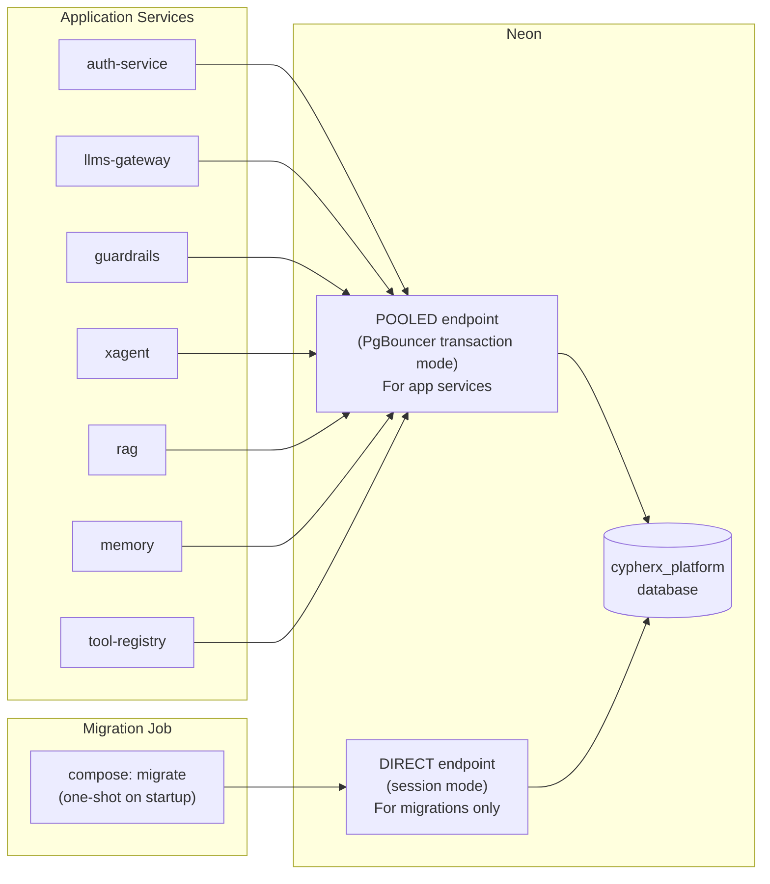
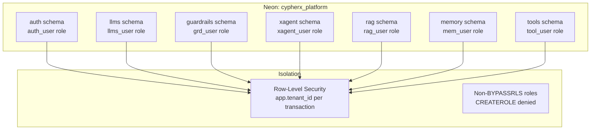
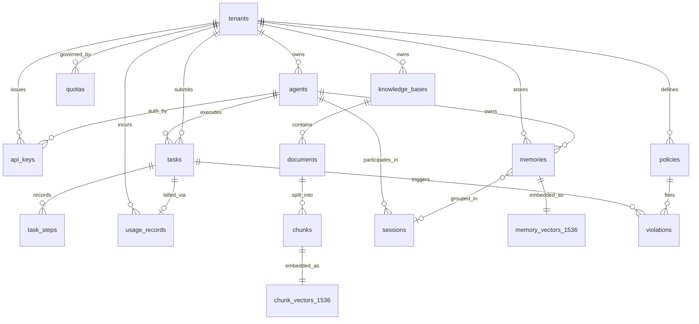

# 08 · Database

## Database Overview

CypherX uses **Neon** — a serverless Postgres platform — as its primary datastore. All services share one Neon project (`cypherx_platform`) but own isolated schemas, roles, and row-level security policies.

| Service | Schema | Runtime Role | DDL Role |
|---------|--------|-------------|---------|
| auth-service | `auth` | `auth_user` | `auth_ddl` |
| llms-gateway | `llms` | `llms_user` | `llms_ddl` |
| guardrails-service | `guardrails` | `grd_user` | `grd_ddl` |
| xAgent / ax-1 | `xagent` | `xagent_user` | `xagent_ddl` |
| rag-service | `rag` | `rag_user` | `rag_ddl` |
| memory-service | `memory` | `mem_user` | `mem_ddl` |
| tool-registry | `tools` | `tool_user` | `tool_ddl` |
| cypherx-a1 | `cypherx_a1` | `cxa1_user` | `cxa1_ddl` |

### Connection Topology


**Why two endpoints?**
- **POOLED (transaction mode):** Required for multi-replica services. PgBouncer does NOT support session-level operations (`SET app.tenant_id` uses `SET LOCAL` which is transaction-scoped — this works correctly in transaction mode).
- **DIRECT (session mode):** Required for migrations because Atlas uses session-level advisory locks to prevent concurrent schema changes.

---

## Schema Architecture



---

## auth Schema

### Tables

#### `tenants`
| Column | Type | Constraints | Description |
|--------|------|-------------|-------------|
| `tenant_id` | UUID | PK, default gen_random_uuid() | Tenant identifier |
| `name` | TEXT | NOT NULL | Display name |
| `status` | TEXT | NOT NULL, default 'active' | active / suspended / deleted |
| `plan` | TEXT | NOT NULL, default 'free' | Pricing plan |
| `metadata` | JSONB | default '{}' | Arbitrary tenant metadata |
| `created_at` | TIMESTAMPTZ | NOT NULL, default now() | Creation timestamp |
| `updated_at` | TIMESTAMPTZ | NOT NULL, default now() | Last update |

#### `agents`
| Column | Type | Constraints | Description |
|--------|------|-------------|-------------|
| `agent_id` | UUID | PK | Agent identifier |
| `tenant_id` | UUID | NOT NULL, FK → tenants | Owning tenant |
| `name` | TEXT | NOT NULL | Agent display name |
| `description` | TEXT | | Optional description |
| `config` | JSONB | NOT NULL, default '{}' | Agent runtime config |
| `scopes` | TEXT[] | NOT NULL, default '{}' | Allowed scopes |
| `status` | TEXT | NOT NULL, default 'active' | active / suspended / deleted |
| `created_at` | TIMESTAMPTZ | NOT NULL, default now() | |
| `updated_at` | TIMESTAMPTZ | NOT NULL, default now() | |

**RLS Policy:** `tenant_id = current_setting('app.tenant_id')::uuid`

#### `api_keys`
| Column | Type | Constraints | Description |
|--------|------|-------------|-------------|
| `api_key_id` | UUID | PK | Key identifier |
| `tenant_id` | UUID | NOT NULL, FK → tenants | |
| `agent_id` | UUID | NOT NULL, FK → agents | Associated agent |
| `name` | TEXT | NOT NULL | Key display name |
| `key_hash` | TEXT | NOT NULL, UNIQUE | Argon2id hash of raw key |
| `key_prefix` | TEXT | NOT NULL | First 8 chars for display |
| `scopes` | TEXT[] | NOT NULL | Allowed scopes |
| `expires_at` | TIMESTAMPTZ | | Null = never expires |
| `revoked` | BOOLEAN | NOT NULL, default false | |
| `last_used_at` | TIMESTAMPTZ | | |
| `created_at` | TIMESTAMPTZ | NOT NULL, default now() | |

#### `signing_keys`
| Column | Type | Constraints | Description |
|--------|------|-------------|-------------|
| `key_id` | UUID | PK | |
| `kid` | TEXT | NOT NULL, UNIQUE | Key ID for JWKS `kid` field |
| `public_key_pem` | TEXT | NOT NULL | RSA public key (PEM) |
| `encrypted_private_key` | BYTEA | NOT NULL | AES-256-GCM encrypted private key |
| `encryption_context` | JSONB | NOT NULL | KMS/AES encryption metadata |
| `status` | TEXT | NOT NULL | active / rotated / revoked |
| `created_at` | TIMESTAMPTZ | NOT NULL, default now() | |
| `rotated_at` | TIMESTAMPTZ | | When this key was rotated away |
| `expires_at` | TIMESTAMPTZ | | When this key stops being published |

**No RLS on signing_keys** — managed by platform only; auth-service reads with its role (not per-tenant).

#### `revoked_tokens`
| Column | Type | Constraints | Description |
|--------|------|-------------|-------------|
| `jti` | TEXT | PK | JWT ID being revoked |
| `tenant_id` | UUID | NOT NULL | |
| `agent_id` | UUID | | |
| `reason` | TEXT | | Human-readable revocation reason |
| `revoked_at` | TIMESTAMPTZ | NOT NULL, default now() | |
| `expires_at` | TIMESTAMPTZ | NOT NULL | When to purge (= original JWT exp) |

#### `audit_log`
| Column | Type | Constraints | Description |
|--------|------|-------------|-------------|
| `event_id` | UUID | PK | |
| `tenant_id` | UUID | | |
| `agent_id` | UUID | | Actor |
| `action` | TEXT | NOT NULL | e.g., `agent.registered`, `token.revoked` |
| `resource_type` | TEXT | | |
| `resource_id` | TEXT | | |
| `metadata` | JSONB | default '{}' | |
| `ip_address` | TEXT | | |
| `created_at` | TIMESTAMPTZ | NOT NULL, default now() | |

**Append-only:** no UPDATE or DELETE on `audit_log`. Enforced via RLS + GRANT.

#### `outbox`
| Column | Type | Constraints | Description |
|--------|------|-------------|-------------|
| `id` | UUID | PK | |
| `topic` | TEXT | NOT NULL | Kafka topic name |
| `key` | TEXT | | Partition key |
| `payload` | JSONB | NOT NULL | Contract-5 event envelope |
| `created_at` | TIMESTAMPTZ | NOT NULL, default now() | |
| `published_at` | TIMESTAMPTZ | | Set by relay after publish |
| `attempts` | INT | NOT NULL, default 0 | Retry count |

---

## llms Schema

### Tables

#### `usage_records`
| Column | Type | Constraints | Description |
|--------|------|-------------|-------------|
| `record_id` | UUID | PK | |
| `tenant_id` | UUID | NOT NULL | |
| `agent_id` | UUID | NOT NULL | |
| `llm_call_id` | UUID | NOT NULL, UNIQUE per tenant | Gateway-minted billing key |
| `request_id` | TEXT | | Caller's X-Request-ID |
| `model_alias` | TEXT | NOT NULL | Alias used (e.g., `fast`) |
| `model_id` | TEXT | NOT NULL | Provider model (e.g., `claude-3-5-sonnet-20241022`) |
| `provider` | TEXT | NOT NULL | `anthropic` or `openai` |
| `operation` | TEXT | NOT NULL | `chat_completion`, `embedding`, `rerank` |
| `tokens_prompt` | BIGINT | NOT NULL, default 0 | |
| `tokens_completion` | BIGINT | NOT NULL, default 0 | |
| `tokens_cache_read` | BIGINT | NOT NULL, default 0 | Anthropic cache read tokens |
| `tokens_cache_write` | BIGINT | NOT NULL, default 0 | Anthropic cache write tokens |
| `cost_usd` | NUMERIC(12,8) | NOT NULL | Computed cost |
| `created_at` | TIMESTAMPTZ | NOT NULL, default now() | |

**UNIQUE constraint:** `(tenant_id, llm_call_id)` — prevents double-billing on retry.

#### `model_aliases`
| Column | Type | Description |
|--------|------|-------------|
| `alias` | TEXT PK | Short name (e.g., `fast`, `smart`, `embed-v3`) |
| `provider` | TEXT | `anthropic` or `openai` |
| `model_id` | TEXT | Actual provider model string |
| `is_default` | BOOLEAN | Default model for unspecified alias |

#### `tenant_provider_keys`
| Column | Type | Description |
|--------|------|-------------|
| `key_id` | UUID PK | |
| `tenant_id` | UUID | |
| `provider` | TEXT | `anthropic`, `openai`, `openrouter` |
| `encrypted_key` | BYTEA | AES-256-GCM encrypted BYOK |
| `is_active` | BOOLEAN | |
| `created_at` | TIMESTAMPTZ | |

---

## xagent Schema

### Tables

#### `tasks`
| Column | Type | Description |
|--------|------|-------------|
| `task_id` | UUID PK | |
| `tenant_id` | UUID | RLS key |
| `agent_id` | UUID | |
| `status` | TEXT | `pending`, `processing`, `completed`, `failed`, `cancelled` |
| `input_text` | TEXT | Raw user input |
| `input_metadata` | JSONB | Task metadata (session_id, source, etc.) |
| `response_text` | TEXT | Final model response |
| `error_code` | TEXT | Set on failure |
| `error_message` | TEXT | |
| `cost_usd` | NUMERIC(12,8) | Total task cost |
| `idempotency_key` | TEXT | Unique on (tenant_id, idempotency_key) |
| `created_at` | TIMESTAMPTZ | |
| `completed_at` | TIMESTAMPTZ | |

#### `task_steps`
| Column | Type | Description |
|--------|------|-------------|
| `step_id` | UUID PK | |
| `task_id` | UUID FK → tasks | |
| `tenant_id` | UUID | RLS key |
| `stage` | TEXT | Pipeline stage name |
| `decision` | TEXT | Stage outcome |
| `details` | JSONB | Stage-specific data (check_id, model, tokens, etc.) |
| `duration_ms` | INT | Stage execution time |
| `created_at` | TIMESTAMPTZ | |

---

## rag Schema

### Tables

#### `knowledge_bases`
| Column | Type | Description |
|--------|------|-------------|
| `kb_id` | UUID PK | |
| `tenant_id` | UUID | RLS key |
| `name` | TEXT | |
| `description` | TEXT | |
| `embed_model` | TEXT | Alias used for chunk embeddings |
| `status` | TEXT | `active`, `archived` |
| `created_at` | TIMESTAMPTZ | |

#### `documents`
| Column | Type | Description |
|--------|------|-------------|
| `doc_id` | UUID PK | |
| `kb_id` | UUID FK | |
| `tenant_id` | UUID | RLS key |
| `title` | TEXT | |
| `content_hash` | TEXT | SHA-256 of raw content (dedup) |
| `status` | TEXT | `pending`, `processing`, `indexed`, `failed` |
| `chunk_count` | INT | |
| `storage_path` | TEXT | MinIO object key |
| `created_at` | TIMESTAMPTZ | |
| `indexed_at` | TIMESTAMPTZ | |

#### `chunks`
| Column | Type | Description |
|--------|------|-------------|
| `chunk_id` | UUID PK | |
| `doc_id` | UUID FK | |
| `tenant_id` | UUID | RLS key |
| `content` | TEXT | Chunk text |
| `chunk_index` | INT | Position in document |
| `token_count` | INT | |
| `created_at` | TIMESTAMPTZ | |

#### `chunk_vectors_1536`
| Column | Type | Description |
|--------|------|-------------|
| `chunk_id` | UUID PK FK → chunks | |
| `tenant_id` | UUID | RLS key |
| `embedding` | VECTOR(1536) | pgvector embedding |

**Index:** `USING ivfflat (embedding vector_cosine_ops) WITH (lists = 100)` — enables fast ANN search.

---

## memory Schema

### Tables

#### `memories`
| Column | Type | Description |
|--------|------|-------------|
| `memory_id` | UUID PK | |
| `tenant_id` | UUID | RLS key |
| `agent_id` | UUID | |
| `session_id` | UUID FK → sessions | Optional grouping |
| `content` | TEXT | Memory text |
| `importance` | FLOAT | 0.0–1.0 importance score |
| `is_mock` | BOOLEAN | True if embedding was mocked |
| `created_at` | TIMESTAMPTZ | |

#### `memory_vectors_1536`
| Column | Type | Description |
|--------|------|-------------|
| `memory_id` | UUID PK FK → memories | |
| `tenant_id` | UUID | RLS key |
| `embedding` | VECTOR(1536) | pgvector embedding |

#### `sessions`
| Column | Type | Description |
|--------|------|-------------|
| `session_id` | UUID PK | |
| `tenant_id` | UUID | RLS key |
| `agent_id` | UUID | |
| `name` | TEXT | |
| `created_at` | TIMESTAMPTZ | |

---

## Full ER Diagram



---

## Migrations (Contract 14)

### Convention
- Tool: **Atlas** (HCL + SQL)
- File naming: `YYYYMMDD_NNNN__<description>.sql` (e.g., `20260611_0001__init.sql`)
- All migrations are **idempotent**: use `CREATE ... IF NOT EXISTS`, `DO $$ BEGIN ... EXCEPTION WHEN duplicate_object THEN NULL; END $$`
- **Init file** (`*__init.sql`): creates schema, role, extensions, tables, RLS policies, indexes, grants.
- **Seed file** (`*__seed.sql`): inserts platform defaults (platform tenant, default model aliases, bootstrap service ACL rows).

### Migration Job (Compose)
```bash
docker compose --profile migrate up migrate
```

Executes against the **DIRECT** Neon endpoint in dependency order:
1. `auth` → `llms` → `guardrails` → `xagent` → `rag` → `memory` → `tools`

Each service's `db/migrations/` directory is mounted into the migrate container.

### Role Split
| Role | Privileges | Used By |
|------|-----------|---------|
| `<svc>_user` | SELECT, INSERT, UPDATE, DELETE on own schema | Runtime service |
| `<svc>_ddl` | CREATE, ALTER, DROP on own schema | Migration job only |

This prevents runtime code from accidentally mutating schema.

### Neon Setup Steps
1. Create Neon project with database `cypherx_platform`.
2. Note both endpoints: POOLED (contains `-pooler`) and DIRECT.
3. `sslmode=require` is mandatory on both.
4. Create owner role (used by migration job) with `CREATEDB` privilege.
5. Run `docker compose --profile migrate up migrate`.

---

## Backup Strategy

| Environment | Strategy |
|-------------|---------|
| **Local / Dev** | Neon branch snapshots; restore by creating a new branch from a point-in-time restore |
| **Staging** | Neon PITR (point-in-time restore) up to 30 days; daily snapshot to S3 |
| **Production** | RDS Multi-AZ (automated failover); automated daily snapshots (35-day retention); PITR; cross-region replica |

**Export critical tables:**
```bash
pg_dump --schema=auth --table=auth.tenants --table=auth.agents \
  --table=auth.signing_keys postgresql://... > auth_backup.sql
```

**Never export:**
- `auth.signing_keys.encrypted_private_key` — encryption envelope requires KMS; export without private keys.
- `llms.tenant_provider_keys` — BYOK keys; export encrypted bytes only.
