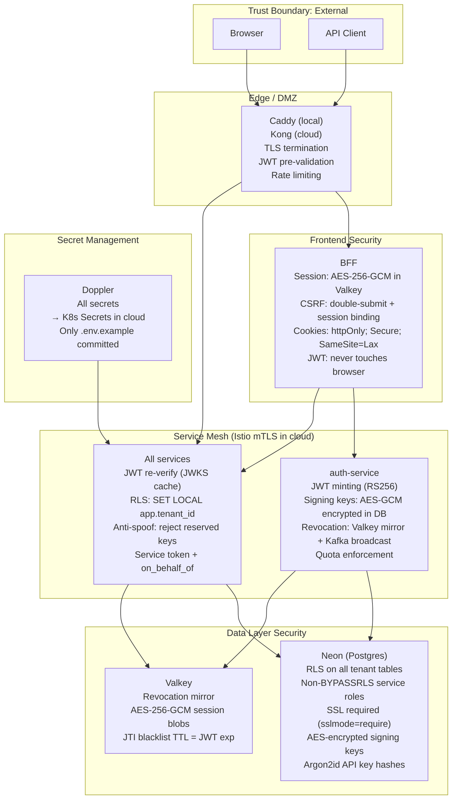
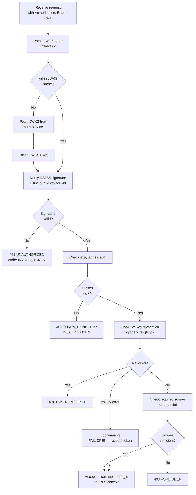
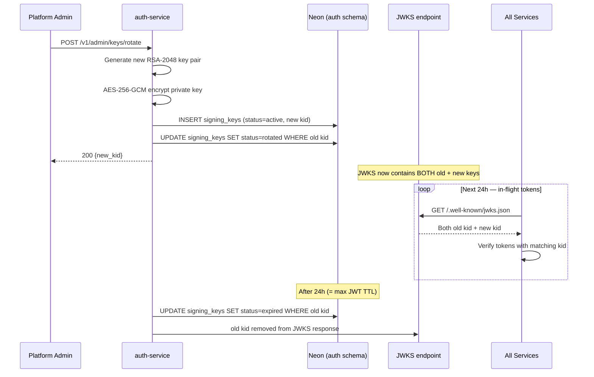
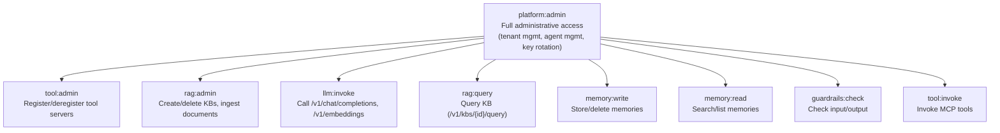
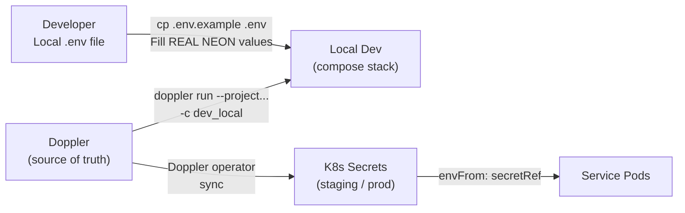
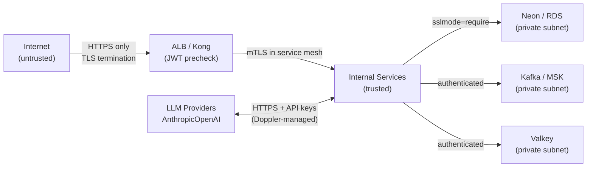

# 09 · Security

## Security Architecture Diagram



---

## Authentication

### JWT Design (Contract 1)

```json
// Header
{
  "alg": "RS256",
  "typ": "JWT",
  "kid": "key-2026-06-01"
}

// Payload
{
  "iss": "https://auth.cypherx.ai",
  "sub": "550e8400-e29b-41d4-a716-446655440001",
  "aud": ["cypherx-platform"],
  "iat": 1750768800,
  "exp": 1750772400,
  "jti": "7b93f1d4-9e2e-4c6d-b8a3-1f0e2d4c6b8a",
  "tenant_id": "550e8400-e29b-41d4-a716-446655440000",
  "agent_id": "550e8400-e29b-41d4-a716-446655440001",
  "api_key_id": "550e8400-e29b-41d4-a716-446655440005",
  "scopes": ["llm:invoke", "memory:read", "guardrails:check"],
  "plan": "pro",
  "deployment_id": "cypherx-prod"
}
```

**Security invariants:**
- Algorithm: **RS256 only** — HS256 is rejected at all JWT verification points.
- `kid` header MUST match a JWKS entry; unknown kids are rejected.
- `iss` and `aud` are configurable env vars — not hardcoded — so they can differ per environment.
- Service tokens (`sub=svc:*`) use 300s TTL; agent tokens ≤3600s.
- JWKS cacheable for 24h; cache must be invalidated on key rotation.

### JWT Verification Flow



### Signing Key Rotation



---

## Authorization (RBAC)

### Scope Hierarchy



### Service-to-Service Authorization (Contract 12)

Internal calls use a **service token** alongside the forwarded agent JWT:

```
Authorization: Bearer <service_jwt>
X-Forwarded-Agent-JWT: <original_agent_jwt>
X-Tenant-ID: <tenant_id>
```

Service token claims:
```json
{
  "sub": "svc:xagent",
  "aud": ["svc:llms-gateway"],
  "on_behalf_of": "550e8400-e29b-41d4-a716-446655440001",
  "scopes": ["llm:invoke"],
  "exp": ...now+300s...
}
```

**Enforcement:** receiving service verifies:
1. Service token signature (RS256 via JWKS).
2. `sub` matches the allowed caller (configured in `auth.service_acl`).
3. `on_behalf_of` MUST equal `agent_id` in the forwarded agent JWT.
4. Agent JWT is also verified (signature + exp + revocation).

---

## Tenant Isolation (Multi-Tenancy)

### Row-Level Security (Contract 13)

Every tenant-scoped table has an RLS policy:

```sql
-- Applied to every tenant table:
ALTER TABLE tasks ENABLE ROW LEVEL SECURITY;

CREATE POLICY tenant_isolation ON tasks
  USING (tenant_id = current_setting('app.tenant_id')::uuid);

-- Every request handler sets this at the start of the transaction:
-- SET LOCAL app.tenant_id = '{tenant_id_from_jwt}';
```

**Key invariants:**
- `SET LOCAL` is used (not `SET SESSION`) — the tenant context is transaction-scoped, safe in PgBouncer transaction mode.
- Service roles are NOT SUPERUSER and NOT BYPASSRLS — cross-tenant access is impossible at the DB engine level.
- The platform tenant (`00000000-0000-0000-0000-000000000001`) has a separate policy: readable by services, writable only by `platform:admin`.

### Anti-Spoof Guards (Contract 3 / 19)

Reserved metadata keys are **rejected** from all request bodies with `400 VALIDATION_ERROR`:

```
tenant_id, trace_id, span_id, request_id, task_id,
user_id, org_id, agent_id
```

These values are injected by the platform (from JWTs or gateway headers) and cannot be spoofed by clients.

---

## Encryption

### Data at Rest

| Data | Encryption | Location |
|------|-----------|---------|
| Signing private keys | AES-256-GCM (envelope encrypted, KMS-managed key) | `auth.signing_keys.encrypted_private_key` |
| BYOK provider keys | AES-256-GCM | `llms.tenant_provider_keys.encrypted_key` |
| Redaction HMAC keys | AES-256-GCM | `guardrails.tenant_redaction_keys` |
| BFF session payload | AES-256-GCM, 96-bit IV, versioned (`v1.<iv>.<tag>.<ct>`) | Valkey |
| API key values | Argon2id hash (original never stored) | `auth.api_keys.key_hash` |
| Database at rest | Neon/RDS encryption at rest (AES-256) | Managed by cloud provider |

### Data in Transit

| Connection | Encryption |
|-----------|-----------|
| Client → Edge | TLS 1.2+ (Caddy/ALB; HTTPS only in prod) |
| Service → Neon | `sslmode=require` (TLS 1.3) |
| Service → Service | Istio mTLS (mutual TLS) in cloud; plain HTTP in local compose (trusted network) |
| Service → Kafka | SASL_SSL in cloud; plain in local compose |
| Service → Valkey | TLS in cloud; plain in local compose |

### Session Encryption (BFF)

```
AES-256-GCM:
  Key: SESSION_KEK_BASE64 (exactly 32 bytes)
  IV: 96-bit random per write
  Format: "v1.<base64(iv)>.<base64(tag)>.<base64(ciphertext)>"
  
On Valkey outage: session reads fail → 401 (fail closed for session security)
```

---

## Secrets Management



**Rules:**
- Only `.env.example` is committed (no real secrets).
- All values in `.env.example` marked `<<< SET REAL NEON VALUE >>>` MUST be replaced before running.
- `SESSION_KEK_BASE64`, bootstrap tokens, service bootstrap secrets in `.env.example` are LOCAL-ONLY throwaways — never reuse in staging/prod.
- In cloud: Doppler operator syncs secrets to K8s Secrets; pods use `envFrom: secretRef`.
- Signing private keys never leave the `auth.signing_keys` table.
- KMS (AWS KMS or HashiCorp Vault) wraps the AES key used to encrypt signing keys.

---

## Audit Logging

All sensitive actions in auth-service write to `auth.audit_log`:

| Action | When |
|--------|------|
| `agent.registered` | New agent created |
| `agent.suspended` | Agent status changed to suspended |
| `agent.deleted` | Agent deleted |
| `token.issued` | JWT minted |
| `token.revoked` | JWT or API key revoked |
| `api_key.issued` | New API key created |
| `api_key.revoked` | API key revoked |
| `signing_key.rotated` | Key rotation completed |
| `quota.exceeded` | Quota limit hit |
| `quota.updated` | Quota limits changed |

The `audit_log` table is **append-only**: the service role has INSERT but not UPDATE or DELETE.

---

## Threat Model

### Threats & Mitigations

| Threat | Mitigation |
|--------|-----------|
| **JWT forgery** | RS256 (asymmetric); public keys in JWKS; HS256 rejected everywhere |
| **Stolen JWT** | Short TTL (≤3600s); JTI revocation via Valkey + Kafka |
| **API key brute-force** | Argon2id hashing; rate limit on `/v1/agents/{id}/token` |
| **Cross-tenant data access** | Postgres RLS enforced at DB engine; non-BYPASSRLS roles |
| **Request body spoofing (tenant_id, trace_id)** | Reserved field rejection with 400 at every service |
| **CSRF** | Double-submit + session binding in BFF; `SameSite=Lax` cookies |
| **XSS → session theft** | `httpOnly` cookie; JWT never exposed to JavaScript |
| **SSRF via image URLs** | Optional SSRF-hardened fetcher (`IMAGE_INLINE_REQUIRED=true`): blocks private IPs, DNS rebind |
| **Prompt injection** | Guardrails service — built-in prompt_injection rule type |
| **PII leakage in LLM output** | Guardrails PII detection + HMAC redaction on output |
| **Provider credential exposure** | BYOK keys AES-encrypted in DB; platform keys in Doppler |
| **Replay attacks** | JTI uniqueness + Idempotency-Key deduplication |
| **Signing key compromise** | Private keys only in DB (encrypted); never in env vars or logs |
| **DB privilege escalation** | Service roles have no CREATEROLE, SUPERUSER, or BYPASSRLS |
| **Supply chain** | Immutable `sha-<sha7>` image tags; ArgoCD GitOps with human approval for prod |
| **Insider threat (prod deploy)** | `prod-apps.yaml` has NO `syncPolicy.automated`; requires human PR approval |

### Attack Surface



The **only public surface** is the edge (Caddy/ALB/Kong). All other services are in private subnets or behind the service mesh.
