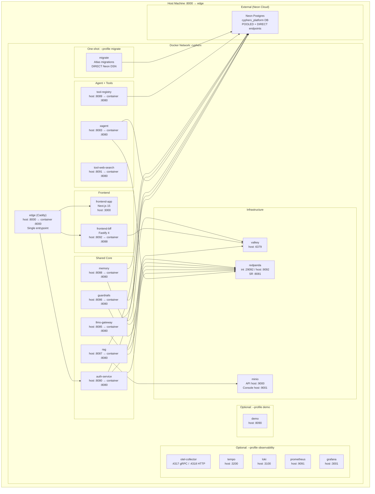
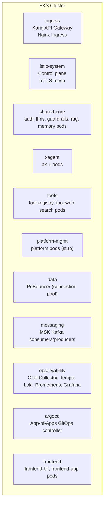
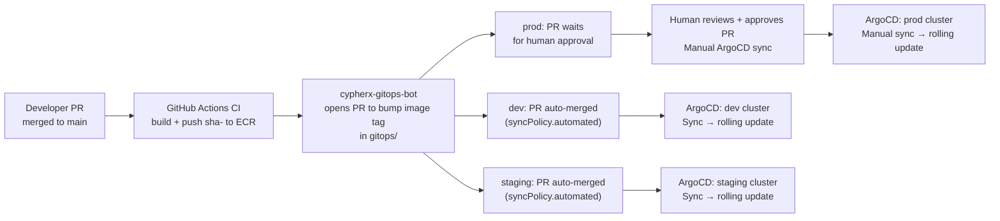
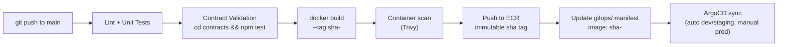

# 10 · Infrastructure

## Overview

CypherX runs on two environment profiles:
1. **Local Compose Stack** — `infra/compose/docker-compose.yml` — for development and integration testing.
2. **Cloud (AWS EKS)** — Terraform + Terragrunt + Helm + ArgoCD — for staging and production.

---

## Local Compose Stack

### Architecture



### Startup Order

`depends_on` + healthchecks enforce this order:

```
1. redpanda (healthcheck: rpk cluster info)
2. valkey (healthcheck: redis-cli ping)
3. minio (healthcheck: mc ready)
4. auth-service (healthcheck: /readyz → 200)
5. llms-gateway, guardrails-service (healthcheck: /readyz → 200)
6. rag, memory (healthcheck: /readyz → 200)
7. tool-registry, tool-web-search (healthcheck: /readyz → 200)
8. xagent (depends on all above)
9. frontend-bff, frontend-app (depends on auth + xagent)
10. edge (depends on bff + app)
```

### Quick Start

```bash
# 1. Clone the repo and navigate to compose directory
cd infra/compose

# 2. Configure environment (Neon values required)
cp .env.example .env
# Edit .env — fill all <<< SET REAL NEON VALUE >>> placeholders

# 3. Run migrations (once, or after schema changes)
docker compose --profile migrate up migrate

# 4. Start the full stack
docker compose up -d --build

# 5. Check all services are healthy
docker compose ps

# 6. Access
# Admin console:    http://localhost:3000
# Auth service:     http://localhost:8080
# xAgent:           http://localhost:8083
# LLMs gateway:     http://localhost:8085
# All via edge:     http://localhost:8000
```

### Environment Variables (`.env`)

| Variable | Required | Description |
|----------|----------|-------------|
| `AUTH_DATABASE_URL` | ✅ | Neon POOLED DSN for auth-service |
| `LLMS_DATABASE_URL` | ✅ | Neon POOLED DSN for llms-gateway |
| `GRD_DATABASE_URL` | ✅ | Neon POOLED DSN for guardrails |
| `XAGENT_DATABASE_URL` | ✅ | Neon POOLED DSN for xagent |
| `RAG_DATABASE_URL` | ✅ | Neon POOLED DSN for rag |
| `MEM_DATABASE_URL` | ✅ | Neon POOLED DSN for memory |
| `TOOL_DATABASE_URL` | ✅ | Neon POOLED DSN for tool-registry |
| `MIGRATE_DATABASE_URL` | ✅ | Neon DIRECT DSN (owner role) |
| `MOCK_PROVIDERS` | — | `true` to use mock LLM (default: true) |
| `MOCK_EMBEDDINGS` | — | `true` for mock embeddings (default: true) |
| `SEARCH_PROVIDER` | — | `mock` / `serpapi` / `brave` (default: mock) |
| `CLASSIFIER_MODE` | — | `stub` / `detoxify` (default: stub) |
| `SESSION_KEK_BASE64` | ✅ | 32-byte AES key for BFF session encryption |
| `AUTH_BOOTSTRAP_TOKEN` | ✅ | One-time token to create platform tenant |
| `ANTHROPIC_API_KEY` | — | Required if `MOCK_PROVIDERS=false` |
| `OPENAI_API_KEY` | — | Required for embeddings if `MOCK_EMBEDDINGS=false` |

---

## Kubernetes (Cloud / AWS EKS)

### Namespace Layout



### Helm Chart (`cypherx-service`)

The base chart `charts/cypherx-service/` provides a standard deployment template for all CypherX services. Every service chart extends it.

**Locked values (schema `const`):**
| Value | Lock | Reason |
|-------|------|--------|
| `logFormat` | `"json"` | Contract 6 structured logging |
| `metrics.port` | `9090` | Contract 7 Prometheus port |
| `probes.liveness.path` | `"/livez"` | Contract 7 |
| `probes.readiness.path` | `"/readyz"` | Contract 7 |
| `securityContext.runAsNonRoot` | `true` | Security hardening |
| `securityContext.readOnlyRootFilesystem` | `true` | Security hardening |
| `securityContext.capabilities.drop` | `["ALL"]` | Least privilege |

**Variable values per service:**
- `image.repository`, `image.tag` (immutable `sha-<sha7>` tags)
- `resources.requests/limits` (CPU + memory)
- `env` (from K8s Secrets via Doppler operator)
- `replicaCount`
- `autoscaling.minReplicas`, `.maxReplicas`, `.targetCPUUtilizationPercentage`

### GitOps (ArgoCD)



**Prod safety gate:**
- `gitops/envs/prod/` MUST NOT contain `syncPolicy.automated`.
- PRs to prod manifests require 2 human approvals.
- ArgoCD prod application requires manual sync trigger.

### CI/CD Pipeline



---

## Terraform / IaC

Repository: `infra/` — `terraform/` (Terragrunt workspaces per env).

### Module Map
| Module | Provisions |
|--------|-----------|
| `infra/terraform/modules/eks` | EKS cluster, node groups, IRSA roles |
| `infra/terraform/modules/rds` | RDS Postgres + Multi-AZ + PgBouncer |
| `infra/terraform/modules/msk` | MSK Kafka cluster + topics |
| `infra/terraform/modules/elasticache` | ElastiCache Valkey cluster |
| `infra/terraform/modules/s3` | S3 buckets (RAG docs, backups) |
| `infra/terraform/modules/kms` | KMS keys for signing key envelope encryption |
| `infra/terraform/modules/networking` | VPC, subnets, security groups, NAT gateway |
| `infra/terraform/modules/argocd` | ArgoCD installation via Helm |
| `infra/terraform/modules/kong` | Kong gateway helm release |

### Node Groups (EKS)

| Node Group | Purpose | Instance Type |
|-----------|---------|--------------|
| `system` | ArgoCD, Istio, Kong | t3.large |
| `core-services` | Auth, LLMs, Guardrails, RAG, Memory | c6i.xlarge |
| `agent-runtime` | xAgent pods (burst scaling) | c6i.2xlarge |
| `tools` | Tool registry, tool servers | t3.large |
| `observability` | OTel, Tempo, Loki, Prometheus, Grafana | r6i.xlarge |

---

## Environment Setup (New Developer)

1. **Install tools:**
   ```bash
   # macOS
   brew install docker docker-compose terraform kubectl helm argocd doppler
   
   # Node 22 + Python 3.12 + Java 21 (for local non-compose dev)
   ```

2. **Doppler CLI auth:**
   ```bash
   doppler login
   doppler setup --project cypherx-platform --config dev_local
   ```

3. **Neon account:** Create Neon project `cypherx_platform`. Note POOLED + DIRECT endpoints.

4. **Configure `.env`:**
   ```bash
   cd infra/compose
   cp .env.example .env
   # Fill Neon DSN values
   ```

5. **Run migrations:**
   ```bash
   docker compose --profile migrate up migrate
   ```

6. **Start the stack:**
   ```bash
   docker compose up -d --build
   ```

7. **Verify:**
   ```bash
   # All services healthy
   docker compose ps
   
   # Smoke test
   curl http://localhost:8000/api/healthz
   curl http://localhost:8080/livez
   curl http://localhost:8083/livez
   ```

---

## Disaster Recovery

### Local / Dev
- No DR needed. Recreate Neon branch from PITR if schema is corrupted.
- `docker compose down && docker compose up -d --build` restores all containers.

### Staging
- Neon PITR (30-day window) + automated daily snapshots to S3.
- Redpanda: data backed up to S3 nightly (MSK in cloud).
- RTO: ~30 minutes | RPO: ~1 hour.

### Production
- RDS Multi-AZ: automatic failover to standby replica (~60s).
- RDS PITR: 35-day window.
- Cross-region read replica: us-east-1 → us-west-2.
- Valkey ElastiCache: cluster mode, 3 shards × 2 replicas.
- S3 versioning + cross-region replication.
- RTO: ~5 minutes (AZ failure), ~2 hours (region failure with cross-region replica) | RPO: ~5 minutes.
- Runbook: [13 · Runbooks — Database Down](../13-runbooks/README.md#database-down).
