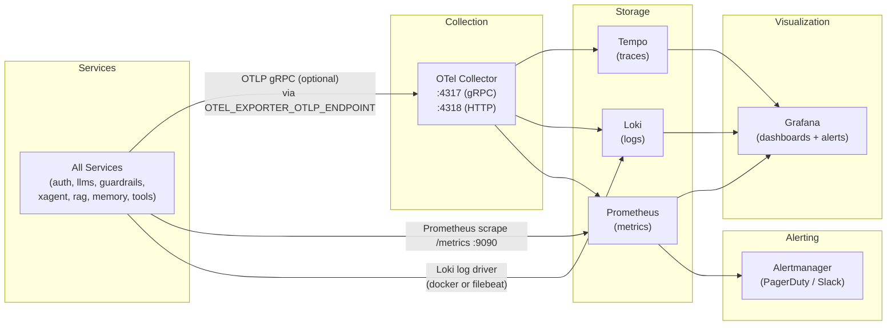
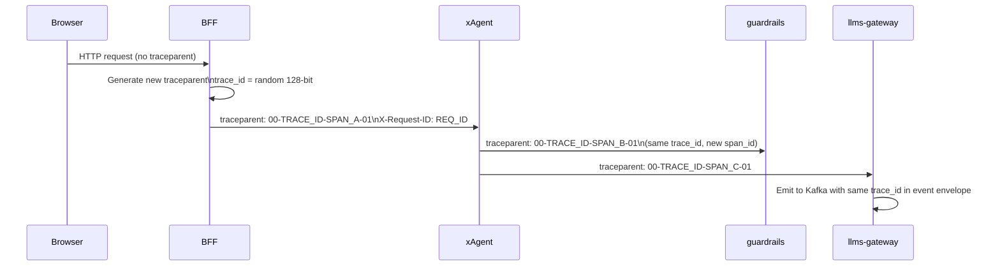

# 11 · Observability

## Overview

CypherX implements the three pillars of observability across every service: **logs**, **metrics**, and **traces**. All are wired up by Contract 6 (logging), Contract 7 (health + metrics), and Contract 8 (tracing).



---

## Logging (Contract 6)

### Format

All services emit structured JSON logs. Plain text logging is prohibited (`logFormat=json` is a schema `const` in the Helm chart).

```json
{
  "timestamp": "2026-06-24T12:00:00.000Z",
  "level": "INFO",
  "service": "xagent",
  "version": "1.2.3",
  "trace_id": "4bf92f3577b34da6a3ce929d0e0e4736",
  "span_id": "00f067aa0ba902b7",
  "tenant_id": "550e8400-e29b-41d4-a716-446655440000",
  "agent_id": "550e8400-e29b-41d4-a716-446655440001",
  "request_id": "7b93f1d4-9e2e-4c6d-b8a3-1f0e2d4c6b8a",
  "message": "Task completed",
  "task_id": "550e8400-e29b-41d4-a716-446655440003",
  "stage": "EVENT",
  "cost_usd": 0.00034,
  "duration_ms": 1250
}
```

### Minimum Required Fields

| Field | Type | Required | Notes |
|-------|------|----------|-------|
| `timestamp` | ISO 8601 UTC | ✅ | |
| `level` | string | ✅ | DEBUG / INFO / WARN / ERROR |
| `service` | string | ✅ | Matches service name in contract |
| `message` | string | ✅ | Human-readable log message |
| `trace_id` | string | ✅ when tracing | From W3C traceparent |
| `tenant_id` | UUID | ✅ when tenant context | |
| `request_id` | UUID | ✅ when HTTP context | |

### Log Levels
| Level | Use |
|-------|-----|
| DEBUG | Detailed internal state (disabled in prod by default) |
| INFO | Normal business events (task submitted, task completed, JWT issued) |
| WARN | Degraded state that didn't cause failure (revocation check failed, mock provider used) |
| ERROR | Failures requiring investigation (DB connection error, provider 5xx, schema violation) |

### Implementation
- **Kotlin (auth-service):** `logstash-logback-encoder` — produces JSON via Logback appender.
- **Python services:** `structlog` with JSON renderer — all logging calls go through `structlog.get_logger()`.
- **Node (BFF):** Fastify's built-in `pino` logger — JSON output by default.

### Sensitive Data in Logs
**NEVER log:**
- Signing private keys, API key values, session tokens, BYOK keys, HMAC keys.
- Full JWT strings (log only `jti` or `kid` for correlation).
- Raw user content from tasks (log only `task_id`).
- Database DSNs.

---

## Metrics (Contract 7)

All services expose Prometheus metrics at `GET /metrics` on port **9090** (fixed `const` in Helm chart). Prometheus scrapes this endpoint every 15 seconds.

### Standard Metrics (All Services)

```prometheus
# HTTP request rate
http_requests_total{service, method, path, status_code}

# HTTP latency histogram (p50, p95, p99)
http_request_duration_seconds{service, method, path}

# Error rate
http_errors_total{service, method, path, error_code}

# Active connections
http_active_connections{service}

# DB connection pool
db_pool_connections_active{service}
db_pool_connections_idle{service}
db_pool_wait_ms{service}

# Outbox depth (pending Kafka messages)
outbox_pending_events{service}
outbox_relay_lag_seconds{service}
```

### Service-Specific Metrics

#### auth-service
```prometheus
# JWT issuance rate
jwt_issued_total{tenant_id}

# JWT revocation rate
jwt_revoked_total{reason}

# Key rotation events
signing_key_rotations_total

# Quota enforcement
quota_exceeded_total{tenant_id, resource_type}
quota_usage_ratio{tenant_id, resource_type}
```

#### llms-gateway
```prometheus
# LLM calls by provider + model
llm_requests_total{provider, model, status}

# Token consumption
llm_tokens_prompt_total{provider, model, tenant_id}
llm_tokens_completion_total{provider, model, tenant_id}

# Cost
llm_cost_usd_total{provider, model, tenant_id}

# Provider latency (excluding CypherX overhead)
llm_provider_duration_seconds{provider, model}

# Embedding calls
embedding_requests_total{provider, model}
```

#### guardrails-service
```prometheus
# Check decisions
guardrails_decisions_total{decision, rule_type}
# decision: allow | warn | redact | block

# Check latency (SLO-relevant)
guardrails_input_check_duration_seconds
guardrails_output_check_duration_seconds

# Violation rate by rule type
guardrails_violations_total{rule_type, severity, tenant_id}
```

#### xAgent / ax-1
```prometheus
# Task submission rate
task_submissions_total{status}

# Task completion rate
task_completions_total{status}
# status: completed | failed | cancelled | guardrail_violation

# Stage duration
task_stage_duration_seconds{stage}
# stage: LOAD | PRE_GUARDRAIL | PROMPT_BUILD | LLM | POST_GUARDRAIL | EVENT

# Task cost
task_cost_usd{tenant_id}
```

---

## Tracing (Contract 8)

### W3C Trace Context

Every HTTP request carries:
```http
traceparent: 00-4bf92f3577b34da6a3ce929d0e0e4736-00f067aa0ba902b7-01
tracestate: cypherx=...
X-Request-ID: 7b93f1d4-9e2e-4c6d-b8a3-1f0e2d4c6b8a
```

Format: `00-<trace-id (32 hex)>-<span-id (16 hex)>-<flags (2 hex)>`

### Propagation



**Same `trace_id` flows through the entire request chain**, including Kafka events. This enables reconstructing the complete call graph from a single `trace_id`.

### Kafka Events

The Contract-5 event envelope includes trace context:
```json
{
  "event_id": "...",
  "event_type": "cypherx.agent.task.completed",
  "schema_version": "1.0.0",
  "produced_at": "2026-06-24T12:00:01Z",
  "tenant_id": "...",
  "producer_service": "xagent",
  "partition_key": "...",
  "trace_context": {
    "traceparent": "00-4bf92f3577b34da6a3ce929d0e0e4736-00f067aa0ba902b7-01",
    "trace_id": "4bf92f3577b34da6a3ce929d0e0e4736",
    "request_id": "7b93f1d4-..."
  },
  "payload": { ... }
}
```

### Trace Export

Tracing is opt-in (to support keyless local dev):
```bash
# Enable trace export
OTEL_EXPORTER_OTLP_ENDPOINT=http://otel-collector:4317

# Disable (default in local)
# (unset OTEL_EXPORTER_OTLP_ENDPOINT)
```

When enabled, spans are exported to Tempo via the OTel Collector.

---

## Dashboards

### Grafana Dashboards (observability profile)

Access at `http://localhost:3001` (local) or `https://grafana.internal` (cloud).

| Dashboard | Key Panels |
|-----------|-----------|
| **Platform Overview** | Request rate, error rate, p99 latency per service |
| **xAgent Task Pipeline** | Task submission rate, stage latencies, cost/hour |
| **LLM Gateway** | Provider calls, token consumption, cost by tenant, cache hit rate |
| **Guardrails** | Decision distribution, violation rate by rule type, p99 check latency (SLO) |
| **Auth Service** | JWT issuance rate, revocation events, quota hit rate |
| **Kafka / Redpanda** | Consumer lag per topic, outbox relay depth, DLQ message rate |
| **Database (Neon/RDS)** | Query latency, connection pool utilization, slow queries |

---

## Alerts

### SLO-Based Alerts

| Alert | Condition | Severity | Action |
|-------|-----------|---------|--------|
| `GuardrailsInputLatencyHigh` | p99 input check > 50ms for 5m | WARNING | Check Neon latency, classifier mode |
| `GuardrailsOutputLatencyHigh` | p99 output check > 100ms for 5m | WARNING | Check Neon latency |
| `LLMGatewayErrorRateHigh` | Error rate > 5% for 5m | CRITICAL | Check provider status, BYOK key validity |
| `xAgentTaskFailureHigh` | Task failure rate > 10% for 5m | CRITICAL | Check guardrails, LLM gateway, DB |
| `OutboxRelayLagging` | outbox_pending_events > 1000 for 10m | WARNING | Check Kafka connectivity, relay logs |
| `JWKSFetchFailing` | JWKS fetch errors > 0 for 2m | CRITICAL | Auth service down — all JWT verification failing |
| `DBConnectionPoolExhausted` | pool connections active = max for 5m | WARNING | Scale service replicas, check query performance |
| `KafkaDLQMessages` | DLQ topic message count > 0 | WARNING | Investigate failed events |
| `NeonReadyzFailing` | `/readyz` returns 503 for 2m | CRITICAL | Service not accepting traffic |

### Alertmanager Routing
- **CRITICAL** → PagerDuty (on-call rotation, immediate page)
- **WARNING** → Slack `#cypherx-alerts` (business hours response)
- **INFO** → Slack `#cypherx-observability` (logged, no notification)

---

## SLOs

| Service | Metric | SLO |
|---------|--------|-----|
| guardrails-service | Input check p99 latency | ≤ 50 ms |
| guardrails-service | Output check p99 latency | ≤ 100 ms |
| llms-gateway | Gateway overhead p99 (ex provider) | ≤ 50 ms |
| auth-service | JWT issuance p99 | ≤ 200 ms |
| xAgent | Task submission → pipeline start p99 | ≤ 100 ms |
| All services | `/readyz` availability | 99.9% (3.9 nines) |
| All services | Error rate (5xx) | ≤ 0.1% |

---

## Running Observability Stack Locally

```bash
cd infra/compose

# Start with observability profile
docker compose --profile observability up -d

# Grafana:    http://localhost:3001
# Prometheus: http://localhost:9091
# Tempo:      http://localhost:3200
# Loki:       http://localhost:3100

# Enable trace export to OTel collector
export OTEL_EXPORTER_OTLP_ENDPOINT=http://localhost:4317
docker compose restart xagent llms-gateway guardrails-service
```
