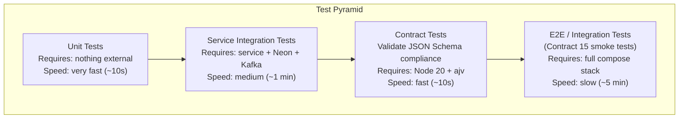

# 12 · Testing

## Testing Strategy

CypherX uses a layered test approach. Lower layers run fast (no external deps); upper layers require a running stack.



---

## Unit Tests

### Python Services
Each service has a `tests/unit/` directory. Run with `uv run pytest`:

```bash
# From any Python service directory (e.g., Shared Core/guardrails/)
uv run pytest tests/unit/ -v

# With coverage
uv run pytest tests/unit/ --cov=app --cov-report=term-missing
```

**What to unit test:**
- Business logic (policy evaluation, token metering, cost calculation)
- Stage pipeline logic (xAgent stage registry)
- JWT claims parsing and validation logic
- Error envelope construction
- Model alias resolution
- Guardrail rule evaluation (stub mode)

**Mocking conventions:**
- Mock external HTTP calls (auth JWKS, LLM provider, guardrails) with `httpx.MockTransport` or `respx`.
- Mock DB with `AsyncMock` for async psycopg3 calls.
- Never mock Postgres RLS logic — that must be tested with a real DB.

### Kotlin (auth-service)
```bash
cd "Shared Core/auth"
./gradlew test

# With coverage
./gradlew jacocoTestReport
```

### Node (frontend-bff)
```bash
cd frontend/bff
npm test

# Watch mode
npm run test:watch
```

---

## Integration Tests

Integration tests require a running Postgres (or Neon branch) and optionally Kafka. They test the full request path within one service.

### Python Services
```bash
# Set DATABASE_URL to a test Neon branch
export DATABASE_URL="postgresql://...test-branch...?sslmode=require"

uv run pytest tests/integration/ -v
```

**What to integration test:**
- Full DB schema: `INSERT`, `SELECT`, RLS enforcement (try cross-tenant access — it must be denied).
- Outbox writes in the same transaction as domain state.
- Kafka consumer deserialization (Contract 5 envelope schema).
- Full HTTP handler flows with a real DB.

### RLS Verification Test Pattern
```python
# Example: verify cross-tenant isolation
async def test_rls_prevents_cross_tenant_access(db_conn):
    # Setup: create task for tenant A
    await db_conn.execute("SET LOCAL app.tenant_id = 'tenant-A-uuid'")
    task_id = await create_task(db_conn, tenant_id="tenant-A-uuid")
    
    # Switch to tenant B context
    await db_conn.execute("SET LOCAL app.tenant_id = 'tenant-B-uuid'")
    result = await db_conn.fetchrow("SELECT * FROM tasks WHERE task_id = $1", task_id)
    
    # RLS must return no rows
    assert result is None
```

---

## Contract Tests

The `contracts/` repo ships a Node 20 ESM validator that validates all JSON Schema instances against their schemas.

```bash
cd contracts
npm install
npm test        # validates all contract schemas + example instances
npm run lint    # lint YAML/JSON formatting
```

**This gate runs in CI on every PR that touches `contracts/`.** A PR that breaks a contract cannot be merged.

### What contract tests validate:
- Every JSON Schema file is valid Draft 2020-12.
- Every OpenAPI file is valid 3.x.
- All example instances in `contracts/*/examples/` pass their schema.
- No duplicate contract numbers.
- Contract changelog entries follow the versioning policy.

### Writing a new contract test:
1. Add the schema to `contracts/<domain>/<name>.schema.json`.
2. Add at least one valid example to `contracts/<domain>/examples/<name>.example.json`.
3. Add an entry to `contracts/index.json` (contract number + description).
4. Run `npm test` to verify.

---

## Contract 15 Smoke Tests (First-Cycle E2E)

The canonical E2E gate. **Must pass twice on a cold dev environment** to declare the first-cycle spine done.

### Prerequisites
- Full compose stack running (`docker compose up -d --build`)
- Migrations completed (`docker compose --profile migrate up migrate`)
- Platform tenant bootstrapped
- `MOCK_PROVIDERS=true` (default — no real API keys needed)

### Cases 1–10 (Spine Gate)

| Case | Tests | Expected |
|------|-------|---------|
| 1 | Register agent → verify in DB | `201`, `agent_id` in response |
| 2 | Issue API key → exchange for JWT | JWT with correct `tenant_id`, `scopes` |
| 3 | Submit task → input guardrail `allow` → LLM mock → output guardrail `allow` → `completed` | `200`, `status: completed`, `response` non-empty |
| 4 | Submit task with prompt injection → input guardrail `block` | `422 GUARDRAIL_VIOLATION` |
| 5 | Verify task_steps recorded: PRE_GUARDRAIL, LLM, POST_GUARDRAIL | All 3 stages in DB |
| 6 | Verify Kafka events: `task.completed` + `llms.request.completed` | Events in Redpanda topic |
| 7 | Submit same task with `Idempotency-Key` twice → second returns cached | `Idempotent-Replayed: true` header |
| 8 | Verify `traceparent` propagated: same `trace_id` in logs across services | Correlated trace in Tempo |
| 9 | Revoke agent JWT → retry request → `401 TOKEN_REVOKED` | `401` within one Kafka lag window |
| 10 | Cancel in-flight task → `GET /v1/tasks/{id}` → `cancelled` | `status: cancelled` |

### Cases 11–15 (Enterprise Wave Gate)

| Case | Tests | Expected |
|------|-------|---------|
| 11 | Submit task with `STAGE_ENABLE_RAG_QUERY=true` → KB query included in prompt | RAG context in task_steps |
| 12 | Submit task with `STAGE_ENABLE_MEMORY_RETRIEVE=true` → memory retrieved | Memory step in task_steps |
| 13 | Submit task with `STAGE_ENABLE_TOOL_LOOP=true` + tool_calls in LLM response → tool invoked → final response | Tool invocation step in task_steps |
| 14 | SSE streaming task → events streamed incrementally | SSE `data:` events before final `data: [DONE]` |
| 15 | Chaos: kill guardrails-service mid-task → task fails gracefully | `500 SERVICE_UNAVAILABLE`, no orphaned DB rows |

### Running the smoke tests:
```bash
cd contracts/smoke-tests
npm install
npm test

# Run specific case
npm test -- --grep "case-03"

# Run twice on cold stack (definition of done)
docker compose down && docker compose up -d --build
npm test
docker compose down && docker compose up -d --build
npm test
```

---

## Load Tests

Load testing is part of WP14 (production hardening). Use k6 or Locust.

### Key Scenarios

```javascript
// k6 scenario: task submission under load
import http from 'k6/http';
import { check } from 'k6';

export const options = {
  scenarios: {
    task_submission: {
      executor: 'constant-arrival-rate',
      rate: 100,            // 100 RPS
      timeUnit: '1s',
      duration: '5m',
      preAllocatedVUs: 50,
    },
  },
  thresholds: {
    http_req_duration: ['p(99)<500'],    // xAgent p99 < 500ms (excl. LLM)
    http_req_failed: ['rate<0.001'],      // error rate < 0.1%
  },
};

export default function () {
  const res = http.post(
    'http://localhost:8083/v1/tasks',
    JSON.stringify({ agent_id: '...', input: { content: 'test' } }),
    { headers: { 'Content-Type': 'application/json', Authorization: `Bearer ${JWT}` } }
  );
  check(res, { 'status 200': (r) => r.status === 200 });
}
```

### Guardrails SLO Load Test
```python
# locust: verify p99 guardrails latency under load
class GuardrailUser(HttpUser):
    wait_time = between(0.01, 0.05)
    
    @task
    def check_input(self):
        self.client.post("/v1/check/input",
            json={"text": "Hello, world!", "task_id": str(uuid4())},
            headers={"Authorization": f"Bearer {SVC_TOKEN}"}
        )
```

---

## Security Tests

### OWASP Top 10 Checks

| Check | How |
|-------|-----|
| SQL injection | Use parameterized queries (psycopg3 + Spring Data); test with `'; DROP TABLE tasks; --` as input |
| XSS | BFF sanitizes all output; CSRF header enforcement; `httpOnly` cookies |
| Broken authentication | Test expired JWT → 401; revoked JWT → 401; wrong `kid` → 401 |
| IDOR | Test accessing another tenant's task with own JWT → 404 (RLS hides it) |
| SSRF | If `IMAGE_INLINE_REQUIRED=true`: test private IP URL → rejected |
| Reserved field injection | Send `{"tenant_id": "evil-uuid"}` in request body → `400 VALIDATION_ERROR` |
| Privilege escalation | Token without `platform:admin` scope → `403 FORBIDDEN` on admin endpoints |
| Cross-tenant | Agent JWT from tenant A → GET tasks from tenant B → empty list (RLS) |

### Running Security Scans

```bash
# Container image scan (Trivy)
trivy image cypherx/auth-service:sha-abc1234

# SAST (Bandit for Python)
cd "Shared Core/llms"
uv run bandit -r app/ -ll

# Dependency audit
uv run pip-audit

# Node (BFF)
cd frontend/bff
npm audit

# Kotlin (auth-service)
cd "Shared Core/auth"
./gradlew dependencyCheckAnalyze
```

---

## CI Test Matrix

| Stage | Tool | When | Gate |
|-------|------|------|------|
| Contract validation | `npm test` in `contracts/` | Every PR touching `contracts/` | Required |
| Python unit tests | `uv run pytest tests/unit/` | Every PR | Required |
| Python lint | `ruff check .` | Every PR | Required |
| Kotlin unit tests | `./gradlew test` | Every PR | Required |
| Node unit tests | `npm test` | Every PR | Required |
| Container build | `docker build` | Every PR | Required |
| Container scan | Trivy | Every PR | Required |
| Smoke tests 1–10 | `npm test` in `contracts/smoke-tests/` | Main branch merge | Required for release |
| Smoke tests 11–15 | Same | Main branch merge | Required for first-cycle sign-off |
| Load tests | k6 | Weekly / pre-release | Advisory |
| Security scan | Bandit + Trivy + npm audit | Weekly | Advisory |
