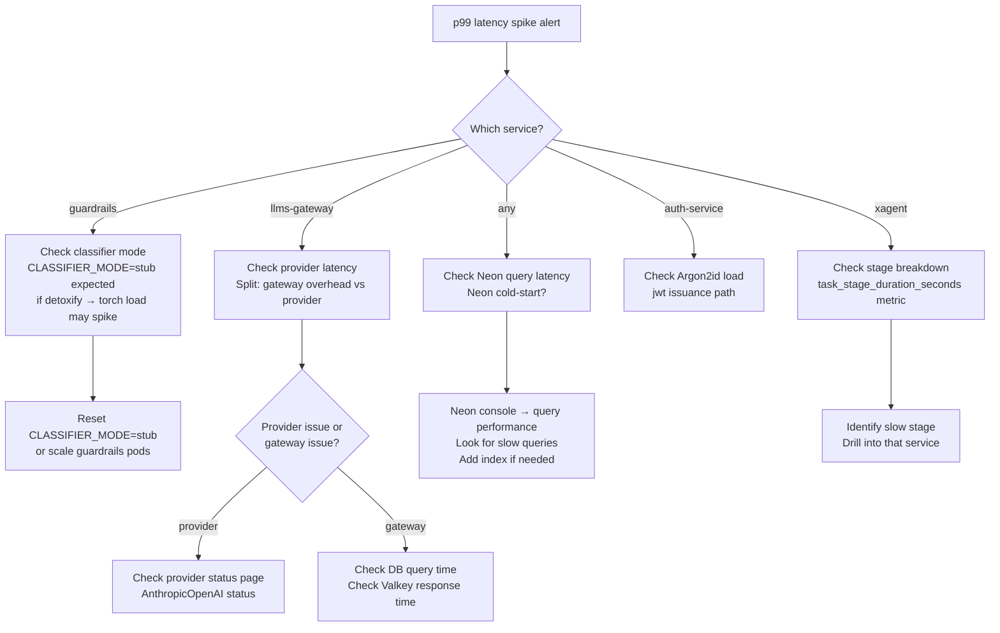

# 13 · Runbooks

## Runbook Index

| Runbook | Trigger |
|---------|---------|
| [Service Down](#service-down) | A service `/readyz` fails or pod CrashLoops |
| [Database Down](#database-down) | Neon / RDS unreachable or error rate spikes |
| [Kafka Down](#kafka-down) | Redpanda / MSK unreachable or consumer lag explodes |
| [High Latency](#high-latency) | p99 latency breaches SLO alert |
| [Guardrails Latency SLO Breach](#guardrails-latency-slo-breach) | Guardrail checks exceeding 50/100ms |
| [LLM Gateway Error Rate High](#llm-gateway-error-rate-high) | LLM calls failing > 5% |
| [JWT / Auth Failure](#jwt--auth-failure) | 401 rate spikes across services |
| [Rollback](#rollback) | Bad deploy needs to be reverted |
| [Recovery — Cold Start](#recovery--cold-start) | Full stack restart after outage |
| [GDPR Wipe Request](#gdpr-wipe-request) | User data deletion request |

---

## Service Down

**Symptom:** Alert `NeonReadyzFailing` fires, or `docker compose ps` shows a service as `unhealthy` / `Exit 1`.

### Diagnosis

```bash
# 1. Check container status
docker compose ps

# 2. View recent logs
docker compose logs --tail=100 <service-name>

# 3. Check readyz endpoint directly
curl -s http://localhost:<port>/readyz | jq .

# 4. Check if it's a dependency issue
docker compose logs --tail=50 redpanda valkey
```

### Common Causes & Fixes

| Cause | Symptom in Logs | Fix |
|-------|----------------|-----|
| Neon cold-start timeout | `connection refused` or `SSL error` | Wait 10-20s; Neon cold starts take up to 3s; `/readyz` retries automatically |
| Bad DATABASE_URL | `password authentication failed` | Check `.env` Neon DSN values; re-run `docker compose up -d` after fix |
| Port conflict | `address already in use` | `docker compose down && docker compose up -d --build` |
| Out of memory | `killed` or `OOMKilled` in K8s | Increase `resources.limits.memory` in Helm values |
| Missing env var | `KeyError` / `Required environment variable not set` | Check `.env` or K8s Secret |
| Migration not run | `relation "tasks" does not exist` | Run `docker compose --profile migrate up migrate` |

### Recovery

```bash
# Restart specific service
docker compose restart <service-name>

# Force rebuild if image issue
docker compose up -d --build <service-name>

# Full stack restart
docker compose down && docker compose up -d --build
```

---

## Database Down

**Symptom:** All services returning 503, logs show `connection refused` or Neon-specific errors.

### Diagnosis

```bash
# 1. Test connectivity to Neon directly
psql "postgresql://<user>:<pass>@<pooled-host>/<db>?sslmode=require" -c "SELECT 1"

# 2. Check if it's POOLED vs DIRECT issue
# (App services use POOLED; migration uses DIRECT)
psql "postgresql://<user>:<pass>@<direct-host>/<db>?sslmode=require" -c "SELECT 1"

# 3. Check Neon status dashboard
# https://neon.tech/docs/introduction/monitor-status

# 4. Check if connection pool is exhausted
docker compose logs --tail=50 auth-service | grep "pool"
```

### Common Causes & Fixes

| Cause | Fix |
|-------|-----|
| Neon cold-start (serverless) | Wait 10-20s; services retry on `/readyz` |
| Neon project suspended (free tier) | Log into Neon console and resume project |
| Password mismatch | Re-export DSN from Neon console and update `.env` |
| `search_path` option in DSN | Remove `options=-c search_path=...` from DSN; use `ALTER ROLE ... SET search_path` instead |
| Connection pool exhausted | Scale up service replicas; check for connection leaks in logs |
| RDS Multi-AZ failover (cloud) | Wait 60s for automatic failover; CNAME updates propagate |
| PgBouncer misconfigured | Check PgBouncer logs; ensure `pool_mode = transaction` |

### Recovery (Production — RDS)

```bash
# 1. Check RDS instance status in AWS Console
aws rds describe-db-instances --db-instance-identifier cypherx-prod

# 2. Force failover if primary is stuck
aws rds reboot-db-instance --db-instance-identifier cypherx-prod --force-failover

# 3. Verify new primary is serving
aws rds describe-db-instances --db-instance-identifier cypherx-prod \
  | jq '.DBInstances[0].DBInstanceStatus'
```

---

## Kafka Down

**Symptom:** Alert `OutboxRelayLagging` fires; `outbox_pending_events` metric > 1000; services logging Kafka connection errors.

### Diagnosis

```bash
# 1. Check Redpanda container
docker compose logs --tail=100 redpanda

# 2. Test Kafka connectivity
docker compose exec redpanda rpk cluster info

# 3. Check topic health
docker compose exec redpanda rpk topic list

# 4. Check consumer lag
docker compose exec redpanda rpk group describe xagent-outbox-relay

# 5. Check DLQ topics for messages
docker compose exec redpanda rpk topic consume cypherx.agent.task.completed.dlq --num 5
```

### Impact Assessment

**Kafka down does NOT cause task failures** — the transactional outbox pattern means:
- Services continue to process requests normally.
- Domain state (tasks, usage records) is written to Postgres successfully.
- Kafka events accumulate in the `outbox` tables.
- Once Kafka recovers, the outbox relay catches up automatically.

**However:** downstream consumers (billing, analytics) will lag until Kafka recovers.

### Recovery

```bash
# 1. Restart Redpanda
docker compose restart redpanda

# 2. Verify connectivity
docker compose exec redpanda rpk cluster health

# 3. Monitor outbox drain
# Watch outbox_pending_events metric in Prometheus

# 4. If DLQ has messages — investigate and replay
docker compose exec redpanda rpk topic consume cypherx.agent.task.completed.dlq \
  | head -20  # inspect messages

# Replay DLQ to main topic (only after fixing root cause)
# (manual process — pipe DLQ messages back to main topic)
```

---

## High Latency

**Symptom:** p99 latency alert fires for a service.

### Diagnosis Flowchart



### Quick Checks

```bash
# xAgent stage breakdown
curl -s http://localhost:9091/metrics | grep task_stage_duration

# Guardrails check latency
curl -s http://localhost:9086/metrics | grep guardrails_.*check_duration

# DB query time (Neon console → Query Performance)
# Look for queries taking > 10ms

# Provider latency (llms-gateway logs)
docker compose logs llms-gateway --tail=50 | grep "provider_latency_ms"
```

---

## Guardrails Latency SLO Breach

**SLO:** Input check p99 ≤ 50ms, Output check p99 ≤ 100ms.

### Common Causes

| Cause | Fix |
|-------|-----|
| Neon cold-start (servlerless) | Pre-warm Neon by querying before load; use persistent connection pools |
| `CLASSIFIER_MODE=detoxify` on slow hardware | Switch to `stub` unless detoxify is required |
| Many custom policies in DB (N+1 query) | Add index on `policies.tenant_id + active`; batch-load policies |
| Guardrails pods underpowered | Increase CPU limits in Helm values |
| Policy rule regex backtracking | Review custom regex rules for catastrophic backtracking |

```bash
# Check classifier mode
docker compose exec guardrails-service env | grep CLASSIFIER_MODE

# Switch to stub if latency is from classifier
docker compose stop guardrails-service
CLASSIFIER_MODE=stub docker compose up -d guardrails-service
```

---

## LLM Gateway Error Rate High

**Symptom:** Alert `LLMGatewayErrorRateHigh` fires; `llm_requests_total{status="error"}` > 5%.

### Diagnosis

```bash
# 1. Check error details
docker compose logs llms-gateway --tail=100 | grep -i "error\|provider"

# 2. Check BYOK key validity
# If a tenant's BYOK key is invalid, only their requests fail
# Look for tenant_id in error logs

# 3. Check provider status
# Anthropic: https://status.anthropic.com
# OpenAI: https://status.openai.com

# 4. Check mock mode
docker compose exec llms-gateway env | grep MOCK_PROVIDERS
```

### Fixes

| Cause | Fix |
|-------|-----|
| Provider API outage | No fix; wait for provider recovery; optionally route to backup provider |
| Invalid platform API key | Update `ANTHROPIC_API_KEY` / `OPENAI_API_KEY` in Doppler |
| Invalid tenant BYOK key | Tenant must update their key via `POST /v1/keys` |
| Rate limit from provider | Enable request queuing; add exponential backoff |
| `MOCK_PROVIDERS=false` with empty key | Set `MOCK_PROVIDERS=true` for keyless dev |

---

## JWT / Auth Failure

**Symptom:** 401 rate spike across multiple services.

### Diagnosis

```bash
# 1. Test JWKS endpoint directly
curl -s http://localhost:8080/.well-known/jwks.json | jq .

# 2. Check auth-service health
curl -s http://localhost:8080/readyz | jq .

# 3. Check for key rotation event (expected 401s during rotation window)
docker compose logs auth-service --tail=50 | grep "key_rotation\|kid"

# 4. Check revocation mirror
# (If Valkey is down, fail-open: 401s should stop)
docker compose logs valkey --tail=20
```

### Common Causes

| Cause | Fix |
|-------|-----|
| Auth-service down | See [Service Down](#service-down) |
| Key rotated but other services cached old JWKS | Services re-fetch JWKS on `kid` miss; should auto-recover in < 30s |
| Valkey restart cleared revocation mirror | Normal; Kafka consumer will rebuild mirror from `token.revoked` topic |
| Mass revocation triggered | Investigate reason; if accidental, re-issue tokens |
| Wrong `iss` or `aud` in tokens | Check `AUTH_ISSUER_URL` and `AUTH_PLATFORM_AUDIENCE` env vars match across services |

---

## Rollback

**Symptom:** Bad deploy causing errors; need to revert.

### Kubernetes (Cloud) — GitOps Rollback

```bash
# 1. Identify the bad commit in gitops/
cd gitops
git log --oneline envs/prod/ | head -5

# 2. Revert the image tag bump PR
git revert <bad-commit-hash>
git push origin main

# 3. Or directly revert the image tag in the manifest
# Edit gitops/envs/prod/<service>/values.yaml
# Change image.tag back to previous sha-<sha7>

# 4. Trigger ArgoCD sync
argocd app sync cypherx-prod-<service>

# 5. Verify rollout
kubectl rollout status deployment/<service> -n shared-core
```

### Docker Compose (Local) — Rollback

```bash
# 1. Identify the previous image tag
docker images cypherx/<service> --format "{{.Tag}}" | head -5

# 2. Update docker-compose.yml to use previous tag
# Or rebuild from the previous git commit:
git checkout <previous-commit> -- "Shared Core/<service>/"
docker compose up -d --build <service>
```

### Database Rollback

**Never roll back database schema migrations in production.** Instead:
1. Add a forward migration that corrects the issue.
2. Deploy the fix forward.
3. If the migration caused data loss: restore from Neon PITR or RDS snapshot.

```bash
# Neon PITR restore (creates a new branch)
# Via Neon Console → Project → Branches → Restore

# RDS snapshot restore
aws rds restore-db-instance-from-db-snapshot \
  --db-instance-identifier cypherx-prod-restored \
  --db-snapshot-identifier <snapshot-id>
```

---

## Recovery — Cold Start

Full stack restart from scratch (e.g., after a full machine reboot or compose `down`).

```bash
cd infra/compose

# 1. Start infrastructure dependencies first
docker compose up -d redpanda valkey minio

# 2. Wait for deps to be healthy
docker compose ps  # all 3 should be "healthy"

# 3. Run migrations (idempotent — safe to re-run)
docker compose --profile migrate up migrate

# 4. Start all services
docker compose up -d

# 5. Monitor startup (30-60s for all services to reach "healthy")
watch docker compose ps

# 6. Smoke test
curl http://localhost:8080/readyz
curl http://localhost:8083/readyz
curl http://localhost:8085/readyz
curl http://localhost:8086/readyz
```

**Expected startup time:** ~60s for all services to be healthy (Neon cold-start included).

---

## GDPR Wipe Request

**Trigger:** User (via px0 identity system) requests deletion of all their data.

### Scope of Data in CypherX
CypherX stores agent-level data (not end-user data directly). A GDPR wipe in CypherX means:
- Delete all memories associated with the agent principal.
- The requesting service must map the end-user identity to a CypherX `agent_id`.

### Procedure

```bash
# 1. Identify the agent_id for the user (from px0 → CypherX mapping)
AGENT_ID="550e8400-e29b-41d4-a716-446655440001"
TENANT_ID="550e8400-e29b-41d4-a716-446655440000"

# 2. Call GDPR wipe on memory-service
curl -X DELETE http://localhost:8088/v1/gdpr/wipe \
  -H "Authorization: Bearer <platform_admin_jwt>" \
  -H "Content-Type: application/json" \
  -d "{\"agent_id\": \"$AGENT_ID\", \"reason\": \"GDPR Article 17 request\"}"

# Response: 200 {count_deleted: N, wipe_id: "..."}

# 3. Verify Kafka event emitted
docker compose exec redpanda rpk topic consume cypherx.memory.gdpr.wiped --num 1

# 4. Record wipe_id in your GDPR compliance log

# 5. (Optional) Delete agent entirely
curl -X DELETE http://localhost:8080/v1/agents/$AGENT_ID \
  -H "Authorization: Bearer <platform_admin_jwt>"
```

### What Is NOT Deleted Automatically
- `auth.audit_log` — append-only, may need separate process for compliance.
- `llms.usage_records` — billing records; typically retained for financial compliance (7 years).
- Kafka events already published — immutable; set appropriate topic retention policy.

Consult legal team on retention requirements before deleting billing records.
