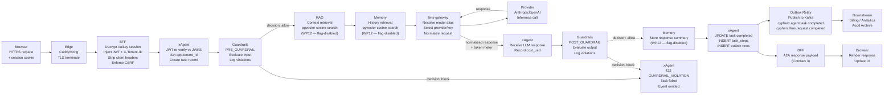

# Data Flow Diagram

> Mermaid source. Shows how data moves from a browser request through the full task pipeline and back.

```mermaid
flowchart LR
    A["Browser\nHTTPS request\n+ session cookie"] --> B["Edge\nCaddy/Kong\nTLS terminate"]
    B --> C["BFF\nDecrypt Valkey session\nInject JWT + X-Tenant-ID\nStrip client headers\nEnforce CSRF"]
    C --> D["xAgent\nJWT re-verify vs JWKS\nSet app.tenant_id\nCreate task record"]
    D --> E["Guardrails\nPRE_GUARDRAIL\nEvaluate input\nLog violations"]
    E -->|decision: allow| F["RAG\nContext retrieval\npgvector cosine search\n(WP12 — flag-disabled)"]
    F --> G["Memory\nHistory retrieval\npgvector cosine search\n(WP12 — flag-disabled)"]
    G --> H["llms-gateway\nResolve model alias\nSelect provider/key\nNormalize request"]
    H --> I["Provider\nAnthropicOpenAI\nInference call"]
    I -->|response| H
    H -->|normalized response\n+ token meter| J["xAgent\nReceive LLM response\nRecord cost_usd"]
    J --> K["Guardrails\nPOST_GUARDRAIL\nEvaluate output\nLog violations"]
    K -->|decision: allow| L["Memory\nStore response summary\n(WP12 — flag-disabled)"]
    L --> M["xAgent\nUPDATE task completed\nINSERT task_steps\nINSERT outbox rows"]
    M --> N["Outbox Relay\nPublish to Kafka\ncypherx.agent.task.completed\ncypherx.llms.request.completed"]
    N --> O["Downstream\nBilling / Analytics\nAudit Archive"]
    M --> P["BFF\nA2A response payload\n(Contract 3)"]
    P --> Q["Browser\nRender response\nUpdate UI"]
    E -->|decision: block| R["xAgent\n422 GUARDRAIL_VIOLATION\nTask failed\nEvent emitted"]
    K -->|decision: block| R
```
