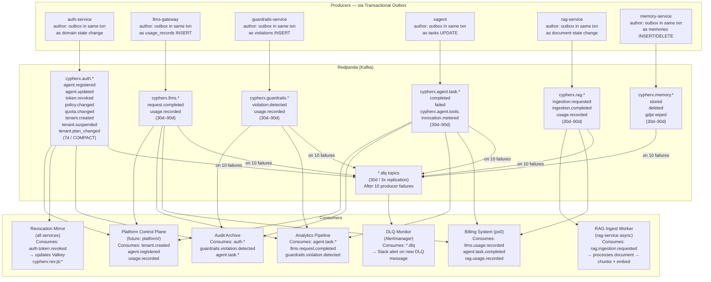

# Event Flow Diagram

> Mermaid source. Shows every Kafka topic, its producer, and its consumers.

```mermaid
flowchart TB
    subgraph "Producers — via Transactional Outbox"
        P1["auth-service\nauthor: outbox in same txn\nas domain state change"]
        P2["llms-gateway\nauthor: outbox in same txn\nas usage_records INSERT"]
        P3["guardrails-service\nauthor: outbox in same txn\nas violations INSERT"]
        P4["xagent\nauthor: outbox in same txn\nas tasks UPDATE"]
        P5["rag-service\nauthor: outbox in same txn\nas document state change"]
        P6["memory-service\nauthor: outbox in same txn\nas memories INSERT/DELETE"]
    end

    subgraph "Redpanda (Kafka)"
        T_auth["cypherx.auth.*\nagent.registered\nagent.updated\ntoken.revoked\npolicy.changed\nquota.changed\ntenant.created\ntenant.suspended\ntenant.plan_changed\n(7d / COMPACT)"]
        T_llms["cypherx.llms.*\nrequest.completed\nusage.recorded\n(30d–90d)"]
        T_gr["cypherx.guardrails.*\nviolation.detected\nusage.recorded\n(30d–90d)"]
        T_agent["cypherx.agent.task.*\ncompleted\nfailed\ncypherx.agent.tools.\ninvocation.metered\n(30d–90d)"]
        T_rag["cypherx.rag.*\ningestion.requested\ningestion.completed\nusage.recorded\n(30d–90d)"]
        T_mem["cypherx.memory.*\nstored\ndeleted\ngdpr.wiped\n(30d–90d)"]
        DLQ["*.dlq topics\n(30d / 3x replication)\nAfter 10 producer failures"]
    end

    subgraph "Consumers"
        C1["Billing System (px0)\nConsumes: llms.usage.recorded\nagent.task.completed\nrag.usage.recorded"]
        C2["Analytics Pipeline\nConsumes: agent.task.*\nllms.request.completed\nguardrails.violation.detected"]
        C3["Audit Archive\nConsumes: auth.*\nguardrails.violation.detected\nagent.task.*"]
        C4["RAG Ingest Worker\n(rag-service async)\nConsumes: rag.ingestion.requested\n→ processes document → chunks + embed"]
        C5["Revocation Mirror\n(all services)\nConsumes: auth.token.revoked\n→ updates Valkey cypherx:rev:jti:*"]
        C6["Platform Control Plane\n(future: platform/)\nConsumes: tenant.created\nagent.registered\nusage.recorded"]
        DLQMonitor["DLQ Monitor\n(Alertmanager)\nConsumes: *.dlq\n→ Slack alert on new DLQ message"]
    end

    P1 --> T_auth
    P2 --> T_llms
    P3 --> T_gr
    P4 --> T_agent
    P5 --> T_rag
    P6 --> T_mem

    T_auth -->|on 10 failures| DLQ
    T_llms -->|on 10 failures| DLQ
    T_gr -->|on 10 failures| DLQ
    T_agent -->|on 10 failures| DLQ
    T_rag -->|on 10 failures| DLQ
    T_mem -->|on 10 failures| DLQ

    T_llms --> C1
    T_agent --> C1
    T_rag --> C1
    T_agent --> C2
    T_llms --> C2
    T_gr --> C2
    T_auth --> C3
    T_gr --> C3
    T_agent --> C3
    T_rag --> C4
    T_auth --> C5
    T_auth --> C6
    T_agent --> C6
    T_llms --> C6
    DLQ --> DLQMonitor
```
