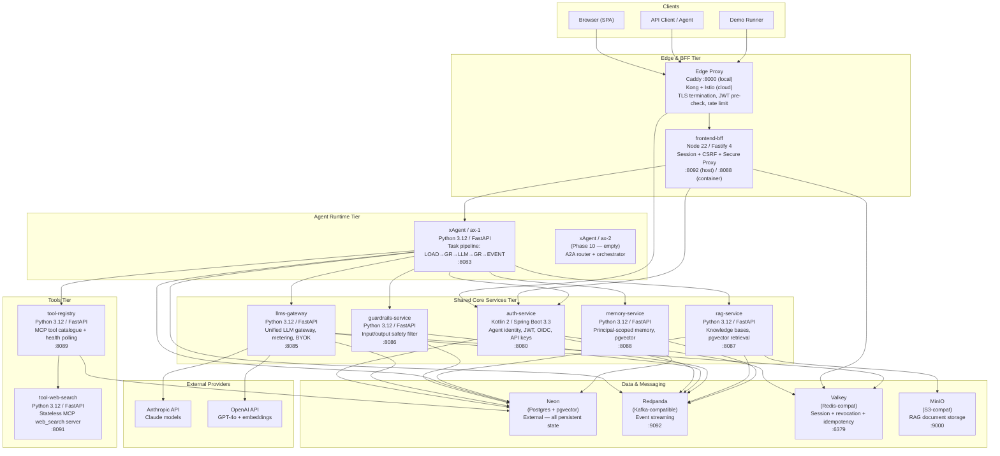

# High-Level Architecture Diagram

> Mermaid source. Shows the four logical tiers of the platform.

```mermaid
graph TB
    subgraph "Clients"
        Browser["Browser (SPA)"]
        APIClient["API Client / Agent"]
        Demo["Demo Runner"]
    end

    subgraph "Edge & BFF Tier"
        Edge["Edge Proxy\nCaddy :8000 (local)\nKong + Istio (cloud)\nTLS termination, JWT pre-check, rate limit"]
        BFF["frontend-bff\nNode 22 / Fastify 4\nSession + CSRF + Secure Proxy\n:8092 (host) / :8088 (container)"]
    end

    subgraph "Shared Core Services Tier"
        Auth["auth-service\nKotlin 2 / Spring Boot 3.3\nAgent identity, JWT, OIDC, API keys\n:8080"]
        LLMs["llms-gateway\nPython 3.12 / FastAPI\nUnified LLM gateway, metering, BYOK\n:8085"]
        GR["guardrails-service\nPython 3.12 / FastAPI\nInput/output safety filter\n:8086"]
        RAG["rag-service\nPython 3.12 / FastAPI\nKnowledge bases, pgvector retrieval\n:8087"]
        Mem["memory-service\nPython 3.12 / FastAPI\nPrincipal-scoped memory, pgvector\n:8088"]
    end

    subgraph "Agent Runtime Tier"
        xA1["xAgent / ax-1\nPython 3.12 / FastAPI\nTask pipeline: LOAD→GR→LLM→GR→EVENT\n:8083"]
        xA2["xAgent / ax-2\n(Phase 10 — empty)\nA2A router + orchestrator"]
    end

    subgraph "Tools Tier"
        TR["tool-registry\nPython 3.12 / FastAPI\nMCP tool catalogue + health polling\n:8089"]
        TWS["tool-web-search\nPython 3.12 / FastAPI\nStateless MCP web_search server\n:8091"]
    end

    subgraph "Data & Messaging"
        Neon["Neon\n(Postgres + pgvector)\nExternal — all persistent state"]
        Redpanda["Redpanda\n(Kafka-compatible)\nEvent streaming\n:9092"]
        Valkey["Valkey\n(Redis-compat)\nSession + revocation + idempotency\n:6379"]
        MinIO["MinIO\n(S3-compat)\nRAG document storage\n:9000"]
    end

    subgraph "External Providers"
        Anthropic["Anthropic API\nClaude models"]
        OpenAI["OpenAI API\nGPT-4o + embeddings"]
    end

    Browser --> Edge
    APIClient --> Edge
    Demo --> Edge
    Edge --> BFF
    Edge --> Auth
    BFF --> Auth
    BFF --> xA1

    xA1 --> Auth
    xA1 --> GR
    xA1 --> LLMs
    xA1 --> RAG
    xA1 --> Mem
    xA1 --> TR
    TR --> TWS
    LLMs --> Anthropic
    LLMs --> OpenAI

    Auth --> Neon
    LLMs --> Neon
    GR --> Neon
    xA1 --> Neon
    RAG --> Neon
    Mem --> Neon
    TR --> Neon
    RAG --> MinIO
    Auth --> Valkey
    BFF --> Valkey
    LLMs --> Valkey
    xA1 --> Redpanda
    Auth --> Redpanda
    LLMs --> Redpanda
    GR --> Redpanda
    RAG --> Redpanda
    Mem --> Redpanda
```
