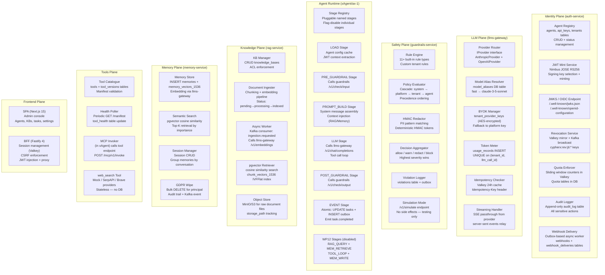

# Platform Component Decomposition

> Mermaid source. Shows the internal component breakdown of each service tier.

```mermaid
graph TB
    subgraph "Identity Plane (auth-service)"
        A1["Agent Registry\nagents, api_keys, tenants tables\nCRUD + status management"]
        A2["JWT Mint Service\nNimbus JOSE RS256\nSigning key selection + minting"]
        A3["JWKS / OIDC Endpoint\n/.well-known/jwks.json\n/.well-known/openid-configuration"]
        A4["Revocation Service\nValkey mirror + Kafka broadcast\ncypherx:rev:jti:* keys"]
        A5["Quota Enforcer\nSliding window counters in Valkey\nQuota tables in DB"]
        A6["Audit Logger\nAppend-only audit_log table\nAll sensitive actions"]
        A7["Webhook Delivery\nOutbox-based async worker\nwebhooks + webhook_deliveries tables"]
    end

    subgraph "LLM Plane (llms-gateway)"
        L1["Provider Router\nIProvider interface\nAnthropicProvider + OpenAIProvider"]
        L2["Model Alias Resolver\nmodel_aliases DB table\nfast → claude-3-5-sonnet"]
        L3["BYOK Manager\ntenant_provider_keys (AES-encrypted)\nFallback to platform key"]
        L4["Token Meter\nusage_records INSERT\nUNIQUE on (tenant_id, llm_call_id)"]
        L5["Idempotency Checker\nValkey 24h cache\nIdempotency-Key header"]
        L6["Streaming Handler\nSSE passthrough from provider\nserver-sent events relay"]
    end

    subgraph "Safety Plane (guardrails-service)"
        G1["Rule Engine\n11+ built-in rule types\nCustom tenant rules"]
        G2["Policy Evaluator\nCascade: system → platform → tenant → agent\nPrecedence ordering"]
        G3["HMAC Redactor\nPII pattern matching\nDeterministic HMAC tokens"]
        G4["Decision Aggregator\nallow / warn / redact / block\nHighest severity wins"]
        G5["Violation Logger\nviolations table + outbox"]
        G6["Simulation Mode\n/v1/simulate endpoint\nNo side effects — testing only"]
    end

    subgraph "Agent Runtime (xAgent/ax-1)"
        X1["Stage Registry\nPluggable named stages\nFlag-disable individual stages"]
        X2["LOAD Stage\nAgent config cache\nJWT context extraction"]
        X3["PRE_GUARDRAIL Stage\nCalls guardrails /v1/check/input"]
        X4["PROMPT_BUILD Stage\nSystem message assembly\nContext injection (RAG/Memory)"]
        X5["LLM Stage\nCalls llms-gateway /v1/chat/completions\nTool call loop"]
        X6["POST_GUARDRAIL Stage\nCalls guardrails /v1/check/output"]
        X7["EVENT Stage\nAtomic: UPDATE tasks + INSERT outbox\nEmit task.completed"]
        X8["WP12 Stages (disabled)\nRAG_QUERY + MEM_RETRIEVE\nTOOL_LOOP + MEM_WRITE"]
    end

    subgraph "Knowledge Plane (rag-service)"
        R1["KB Manager\nCRUD knowledge_bases\nACL enforcement"]
        R2["Document Ingester\nChunking + embedding pipeline\nStatus: pending→processing→indexed"]
        R3["Async Worker\nKafka consumer: ingestion.requested\nCalls llms-gateway /v1/embeddings"]
        R4["pgvector Retriever\ncosine similarity search\nchunk_vectors_1536 IVFFlat index"]
        R5["Object Store\nMinIO/S3 for raw document files\nstorage_path tracking"]
    end

    subgraph "Memory Plane (memory-service)"
        M1["Memory Store\nINSERT memories + memory_vectors_1536\nEmbedding via llms-gateway"]
        M2["Semantic Search\npgvector cosine similarity\nTop-K retrieval by importance"]
        M3["Session Manager\nSession CRUD\nGroup memories by conversation"]
        M4["GDPR Wipe\nBulk DELETE for principal\nAudit trail + Kafka event"]
    end

    subgraph "Tools Plane"
        T1["Tool Catalogue\ntools + tool_versions tables\nManifest validation"]
        T2["Health Poller\nPeriodic GET /manifest\ntool_health table update"]
        T3["MCP Invoker\n(in xAgent) calls tool endpoint\nPOST /mcp/v1/invoke"]
        T4["web_search Tool\nMock / SerpAPI / Brave providers\nStateless — no DB"]
    end

    subgraph "Frontend Plane"
        F1["SPA (Next.js 15)\nAdmin console\nAgents, KBs, tasks, settings"]
        F2["BFF (Fastify 4)\nSession management (Valkey)\nCSRF enforcement\nJWT injection + proxy"]
    end
```
