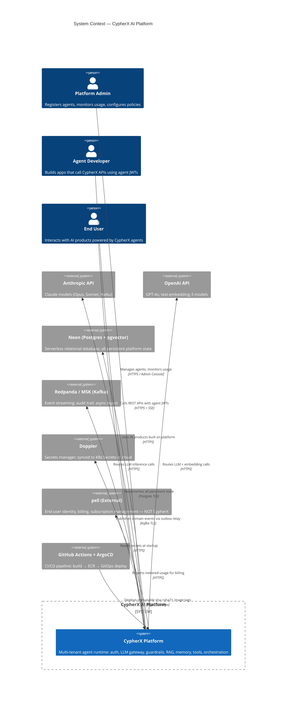

# System Context Diagram

> Mermaid source. Render at https://mermaid.live or in any Mermaid-compatible viewer.

```mermaid
C4Context
    title System Context — CypherX AI Platform

    Person(adminUser, "Platform Admin", "Registers agents, monitors usage, configures policies")
    Person(agentDev, "Agent Developer", "Builds apps that call CypherX APIs using agent JWTs")
    Person(endUser, "End User", "Interacts with AI products powered by CypherX agents")

    System_Boundary(cypherx, "CypherX AI Platform") {
        System(platform, "CypherX Platform", "Multi-tenant agent runtime: auth, LLM gateway, guardrails, RAG, memory, tools, orchestration")
    }

    System_Ext(anthropic, "Anthropic API", "Claude models (Opus, Sonnet, Haiku)")
    System_Ext(openai, "OpenAI API", "GPT-4o, text-embedding-3 models")
    System_Ext(neon, "Neon (Postgres + pgvector)", "Serverless relational database; all persistent platform state")
    System_Ext(redpanda, "Redpanda / MSK (Kafka)", "Event streaming; audit trail; async ingest")
    System_Ext(doppler, "Doppler", "Secrets manager; synced to K8s Secrets in cloud")
    System_Ext(px0, "px0 (External)", "End-user identity, billing, subscription management — NOT CypherX")
    System_Ext(cicd, "GitHub Actions + ArgoCD", "CI/CD pipeline: build → ECR → GitOps deploy")

    Rel(adminUser, platform, "Manages agents, monitors usage", "HTTPS / Admin Console")
    Rel(agentDev, platform, "Calls REST APIs with agent JWTs", "HTTPS + SSE")
    Rel(endUser, platform, "Uses AI products built on platform", "HTTPS")
    Rel(platform, anthropic, "Routes LLM inference calls", "HTTPS")
    Rel(platform, openai, "Routes LLM + embedding calls", "HTTPS")
    Rel(platform, neon, "Reads/writes all persistent state", "Postgres TLS")
    Rel(platform, redpanda, "Publishes domain events via outbox relay", "Kafka TLS")
    Rel(platform, doppler, "Reads secrets at startup", "HTTPS")
    Rel(platform, px0, "Reports metered usage for billing", "HTTPS")
    Rel(cicd, platform, "Deploys immutable sha-<sha7> image tags", "ArgoCD GitOps")
```
