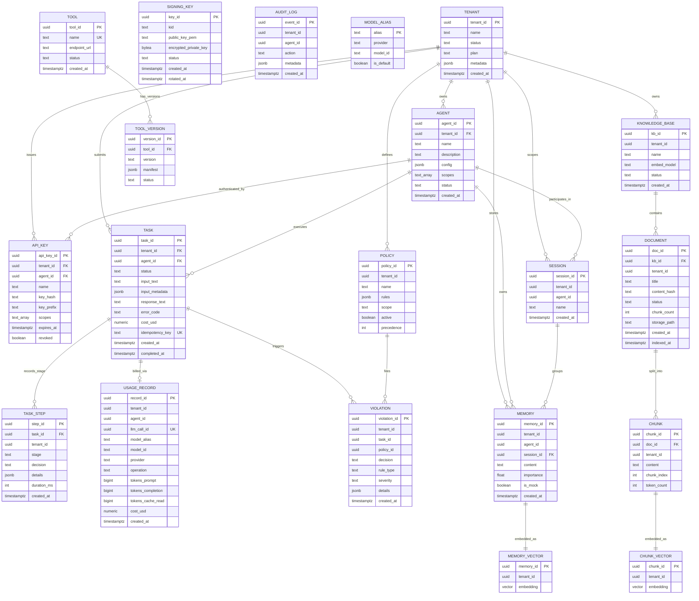

# Entity-Relationship Diagram

> Mermaid source. Shows the full cross-service entity model.

```mermaid
erDiagram
    %% ─── auth schema ───────────────────────────────────
    TENANT {
        uuid tenant_id PK
        text name
        text status
        text plan
        jsonb metadata
        timestamptz created_at
    }
    AGENT {
        uuid agent_id PK
        uuid tenant_id FK
        text name
        text description
        jsonb config
        text_array scopes
        text status
        timestamptz created_at
    }
    API_KEY {
        uuid api_key_id PK
        uuid tenant_id FK
        uuid agent_id FK
        text name
        text key_hash
        text key_prefix
        text_array scopes
        timestamptz expires_at
        boolean revoked
    }
    SIGNING_KEY {
        uuid key_id PK
        text kid
        text public_key_pem
        bytea encrypted_private_key
        text status
        timestamptz created_at
        timestamptz rotated_at
    }
    AUDIT_LOG {
        uuid event_id PK
        uuid tenant_id
        uuid agent_id
        text action
        jsonb metadata
        timestamptz created_at
    }

    %% ─── xagent schema ──────────────────────────────────
    TASK {
        uuid task_id PK
        uuid tenant_id FK
        uuid agent_id FK
        text status
        text input_text
        jsonb input_metadata
        text response_text
        text error_code
        numeric cost_usd
        text idempotency_key UK
        timestamptz created_at
        timestamptz completed_at
    }
    TASK_STEP {
        uuid step_id PK
        uuid task_id FK
        uuid tenant_id
        text stage
        text decision
        jsonb details
        int duration_ms
        timestamptz created_at
    }

    %% ─── llms schema ────────────────────────────────────
    USAGE_RECORD {
        uuid record_id PK
        uuid tenant_id
        uuid agent_id
        uuid llm_call_id UK
        text model_alias
        text model_id
        text provider
        text operation
        bigint tokens_prompt
        bigint tokens_completion
        bigint tokens_cache_read
        numeric cost_usd
        timestamptz created_at
    }
    MODEL_ALIAS {
        text alias PK
        text provider
        text model_id
        boolean is_default
    }

    %% ─── guardrails schema ──────────────────────────────
    POLICY {
        uuid policy_id PK
        uuid tenant_id
        text name
        jsonb rules
        text scope
        boolean active
        int precedence
    }
    VIOLATION {
        uuid violation_id PK
        uuid tenant_id
        uuid task_id
        uuid policy_id
        text decision
        text rule_type
        text severity
        jsonb details
        timestamptz created_at
    }

    %% ─── rag schema ─────────────────────────────────────
    KNOWLEDGE_BASE {
        uuid kb_id PK
        uuid tenant_id
        text name
        text embed_model
        text status
        timestamptz created_at
    }
    DOCUMENT {
        uuid doc_id PK
        uuid kb_id FK
        uuid tenant_id
        text title
        text content_hash
        text status
        int chunk_count
        text storage_path
        timestamptz created_at
        timestamptz indexed_at
    }
    CHUNK {
        uuid chunk_id PK
        uuid doc_id FK
        uuid tenant_id
        text content
        int chunk_index
        int token_count
    }
    CHUNK_VECTOR {
        uuid chunk_id PK
        uuid tenant_id
        vector embedding
    }

    %% ─── memory schema ──────────────────────────────────
    SESSION {
        uuid session_id PK
        uuid tenant_id
        uuid agent_id
        text name
        timestamptz created_at
    }
    MEMORY {
        uuid memory_id PK
        uuid tenant_id
        uuid agent_id
        uuid session_id FK
        text content
        float importance
        boolean is_mock
        timestamptz created_at
    }
    MEMORY_VECTOR {
        uuid memory_id PK
        uuid tenant_id
        vector embedding
    }

    %% ─── tools schema ───────────────────────────────────
    TOOL {
        uuid tool_id PK
        text name UK
        text endpoint_url
        text status
        timestamptz created_at
    }
    TOOL_VERSION {
        uuid version_id PK
        uuid tool_id FK
        text version
        jsonb manifest
        text status
    }

    %% ─── Relationships ──────────────────────────────────
    TENANT ||--o{ AGENT : "owns"
    TENANT ||--o{ API_KEY : "issues"
    AGENT ||--o{ API_KEY : "authenticated_by"
    TENANT ||--o{ TASK : "submits"
    AGENT ||--o{ TASK : "executes"
    TASK ||--o{ TASK_STEP : "records_stage"
    TASK ||--o{ VIOLATION : "triggers"
    TASK ||--o| USAGE_RECORD : "billed_via"
    TENANT ||--o{ POLICY : "defines"
    POLICY ||--o{ VIOLATION : "fires"
    TENANT ||--o{ KNOWLEDGE_BASE : "owns"
    KNOWLEDGE_BASE ||--o{ DOCUMENT : "contains"
    DOCUMENT ||--o{ CHUNK : "split_into"
    CHUNK ||--|| CHUNK_VECTOR : "embedded_as"
    TENANT ||--o{ SESSION : "scopes"
    AGENT ||--o{ SESSION : "participates_in"
    TENANT ||--o{ MEMORY : "stores"
    AGENT ||--o{ MEMORY : "owns"
    SESSION ||--o{ MEMORY : "groups"
    MEMORY ||--|| MEMORY_VECTOR : "embedded_as"
    TOOL ||--o{ TOOL_VERSION : "has_versions"
```
