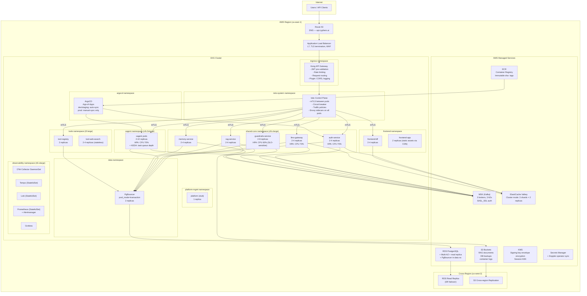

# Cloud / Kubernetes Deployment Diagram

> Mermaid source. Shows the production AWS EKS topology.

```mermaid
graph TB
    subgraph "Internet"
        Users["Users / API Clients"]
    end

    subgraph "AWS Region (us-east-1)"
        R53["Route 53\nDNS — api.cypherx.ai"]
        ALB["Application Load Balancer\nL7, TLS termination, WAF"]

        subgraph "EKS Cluster"
            subgraph "ingress namespace"
                Kong2["Kong API Gateway\n- JWT pre-validation\n- Rate limiting\n- Request routing\n- Plugin: CORS, logging"]
            end

            subgraph "istio-system namespace"
                Istio2["Istio Control Plane\n- mTLS between pods\n- Circuit breaker\n- Traffic policies\n- Envoy sidecars on all pods"]
            end

            subgraph "shared-core namespace (c6i.xlarge)"
                AuthPod2["auth-service\n2-4 replicas\nHPA: CPU 70%"]
                LLMPod2["llms-gateway\n2-4 replicas\nHPA: CPU 70%"]
                GRPod2["guardrails-service\n2-8 replicas\nHPA: CPU 60% (SLO-sensitive)"]
                RAGPod2["rag-service\n2-4 replicas"]
                MemPod2["memory-service\n2-4 replicas"]
            end

            subgraph "xagent namespace (c6i.2xlarge)"
                xAPod2["xagent pods\n2-10 replicas\nHPA: CPU 70%\n+ KEDA: task queue depth"]
            end

            subgraph "tools namespace (t3.large)"
                TRPod2["tool-registry\n2 replicas"]
                TWSPod2["tool-web-search\n2-4 replicas (stateless)"]
            end

            subgraph "frontend namespace"
                BFFPod["frontend-bff\n2-4 replicas"]
                SPAPod["frontend-app\n2 replicas (static assets via CDN)"]
            end

            subgraph "platform-mgmt namespace"
                PlatPod2["platform (stub)\n1 replica"]
            end

            subgraph "data namespace"
                PgBouncer2["PgBouncer\npool_mode=transaction\n2 replicas"]
            end

            subgraph "observability namespace (r6i.xlarge)"
                OTelK8s["OTel Collector DaemonSet"]
                TempoK8s["Tempo (StatefulSet)"]
                LokiK8s["Loki (StatefulSet)"]
                PromK8s["Prometheus (StatefulSet)\n+ Alertmanager"]
                GrafK8s["Grafana"]
            end

            subgraph "argocd namespace"
                ArgoCDK8s["ArgoCD\nApp-of-Apps\ndev/staging: auto-sync\nprod: manual-sync only"]
            end
        end

        subgraph "AWS Managed Services"
            RDS2["RDS PostgreSQL\n+ Multi-AZ + read replica\n+ PgBouncer in data ns"]
            MSK2["MSK (Kafka)\n3 brokers, 3 AZs\nSASL_SSL auth"]
            EC3["ElastiCache Valkey\nCluster mode: 3 shards × 2 replicas"]
            S3K8s["S3 Buckets\nRAG documents\nDB backups\ncontainer logs"]
            ECR["ECR\nContainer Registry\nImmutable sha-<sha7> tags"]
            KMS2["KMS\nSigning key envelope encryption\nSession KEK"]
            SecrMgr["Secrets Manager\n+ Doppler operator sync"]
        end

        subgraph "Cross-Region (us-west-2)"
            RDSRR["RDS Read Replica\n(DR failover)"]
            S3Repl["S3 Cross-region Replication"]
        end
    end

    Users --> R53
    R53 --> ALB
    ALB --> Kong2
    Kong2 --> Istio2
    Istio2 -->|mTLS| AuthPod2
    Istio2 -->|mTLS| xAPod2
    Istio2 -->|mTLS| LLMPod2
    Istio2 -->|mTLS| GRPod2
    Istio2 -->|mTLS| RAGPod2
    Istio2 -->|mTLS| MemPod2
    Istio2 -->|mTLS| TRPod2
    Istio2 -->|mTLS| BFFPod
    AuthPod2 --> PgBouncer2
    LLMPod2 --> PgBouncer2
    GRPod2 --> PgBouncer2
    xAPod2 --> PgBouncer2
    RAGPod2 --> PgBouncer2
    MemPod2 --> PgBouncer2
    TRPod2 --> PgBouncer2
    PgBouncer2 --> RDS2
    AuthPod2 --> EC3
    BFFPod --> EC3
    LLMPod2 --> EC3
    xAPod2 --> MSK2
    AuthPod2 --> MSK2
    LLMPod2 --> MSK2
    GRPod2 --> MSK2
    RAGPod2 --> MSK2
    MemPod2 --> MSK2
    RAGPod2 --> S3K8s
    ECR --> ArgoCDK8s
    ArgoCDK8s --> AuthPod2
    ArgoCDK8s --> xAPod2
    RDS2 --> RDSRR
    S3K8s --> S3Repl
```
