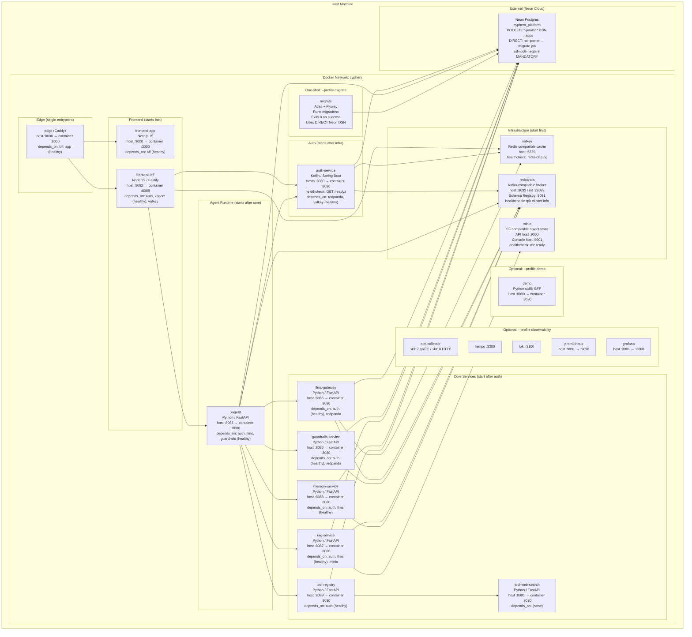

# Docker Compose Stack — Deployment Diagram

> Mermaid source. Shows the local compose stack with all containers, ports, and dependencies.

```mermaid
graph TB
    subgraph "Host Machine"
        subgraph "Docker Network: cypherx"
            subgraph "Infrastructure (start first)"
                RP3["redpanda\nKafka-compatible broker\nhost :9092 / int :29092\nSchema Registry :8081\nhealthcheck: rpk cluster info"]
                VK4["valkey\nRedis-compatible cache\nhost :6379\nhealthcheck: redis-cli ping"]
                MN3["minio\nS3-compatible object store\nAPI host :9000\nConsole host :9001\nhealthcheck: mc ready"]
            end

            subgraph "Auth (starts after infra)"
                Auth4["auth-service\nKotlin / Spring Boot\nhosts :8080 → container :8080\nhealthcheck: GET /readyz\ndepends_on: redpanda, valkey (healthy)"]
            end

            subgraph "Core Services (start after auth)"
                LLMs4["llms-gateway\nPython / FastAPI\nhost :8085 → container :8080\ndepends_on: auth (healthy), redpanda"]
                GR4["guardrails-service\nPython / FastAPI\nhost :8086 → container :8080\ndepends_on: auth (healthy), redpanda"]
                RAG4["rag-service\nPython / FastAPI\nhost :8087 → container :8080\ndepends_on: auth, llms (healthy), minio"]
                Mem4["memory-service\nPython / FastAPI\nhost :8088 → container :8080\ndepends_on: auth, llms (healthy)"]
                TR4["tool-registry\nPython / FastAPI\nhost :8089 → container :8080\ndepends_on: auth (healthy)"]
                TWS4["tool-web-search\nPython / FastAPI\nhost :8091 → container :8080\ndepends_on: (none)"]
            end

            subgraph "Agent Runtime (starts after core)"
                xA4["xagent\nPython / FastAPI\nhost :8083 → container :8080\ndepends_on: auth, llms, guardrails (healthy)"]
            end

            subgraph "Frontend (starts last)"
                BFF4["frontend-bff\nNode 22 / Fastify\nhost :8092 → container :8088\ndepends_on: auth, xagent (healthy), valkey"]
                SPA4["frontend-app\nNext.js 15\nhost :3000 → container :3000\ndepends_on: bff (healthy)"]
            end

            subgraph "Edge (single entrypoint)"
                Edge3["edge (Caddy)\nhost :8000 → container :8000\ndepends_on: bff, app (healthy)"]
            end

            subgraph "Optional: --profile observability"
                OTel5["otel-collector\n:4317 gRPC / :4318 HTTP"]
                Tempo5["tempo :3200"]
                Loki5["loki :3100"]
                Prom5["prometheus\nhost :9091 → :9090"]
                Graf5["grafana\nhost :3001 → :3000"]
            end

            subgraph "Optional: --profile demo"
                Demo3["demo\nPython stdlib BFF\nhost :8090 → container :8090"]
            end

            subgraph "One-shot: --profile migrate"
                Migrate3["migrate\nAtlas + Flyway\nRuns migrations\nExits 0 on success\nUses DIRECT Neon DSN"]
            end
        end

        subgraph "External (Neon Cloud)"
            Neon4["Neon Postgres\ncypherx_platform\nPOOLED: *-pooler.* DSN → apps\nDIRECT: no -pooler → migrate job\nsslmode=require MANDATORY"]
        end
    end

    Edge3 --> SPA4
    Edge3 --> BFF4
    BFF4 --> Auth4
    BFF4 --> xA4
    BFF4 --> VK4
    xA4 --> Auth4
    xA4 --> GR4
    xA4 --> LLMs4
    xA4 --> RAG4
    xA4 --> Mem4
    xA4 --> TR4
    TR4 --> TWS4
    Auth4 --> Neon4
    LLMs4 --> Neon4
    GR4 --> Neon4
    xA4 --> Neon4
    RAG4 --> Neon4
    Mem4 --> Neon4
    TR4 --> Neon4
    Auth4 --> VK4
    LLMs4 --> VK4
    Auth4 --> RP3
    LLMs4 --> RP3
    GR4 --> RP3
    xA4 --> RP3
    RAG4 --> RP3
    Mem4 --> RP3
    RAG4 --> MN3
    Migrate3 --> Neon4
```
