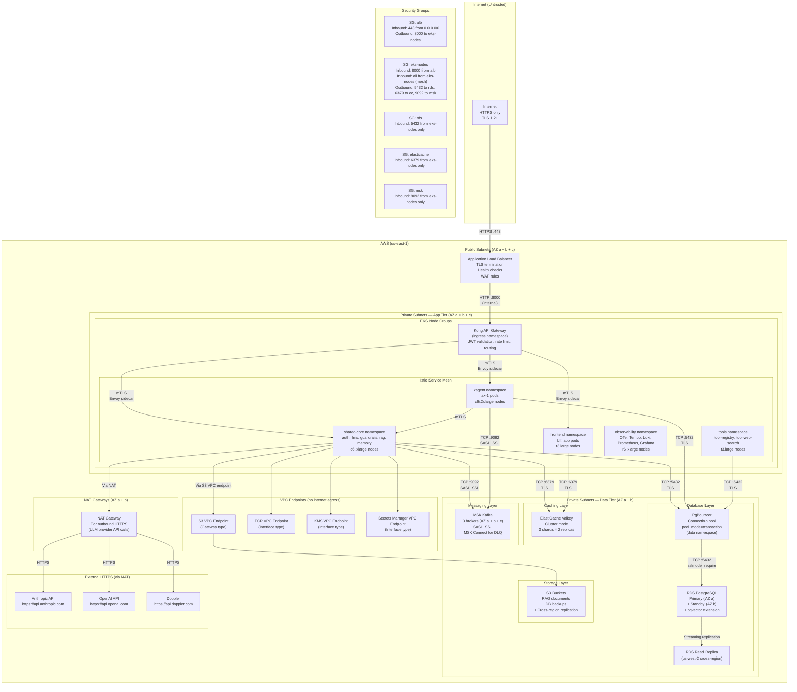

# Network Topology Diagram

> Mermaid source. Shows the cloud network topology with trust zones and traffic flow.

```mermaid
graph TB
    subgraph "Internet (Untrusted)"
        Internet2["Internet\nHTTPS only\nTLS 1.2+"]
    end

    subgraph "AWS (us-east-1)"
        subgraph "Public Subnets (AZ a + b + c)"
            ALB2["Application Load Balancer\nTLS termination\nHealth checks\nWAF rules"]
        end

        subgraph "Private Subnets — App Tier (AZ a + b + c)"
            subgraph "EKS Node Groups"
                Kong3["Kong API Gateway\n(ingress namespace)\nJWT validation, rate limit, routing"]
                subgraph "Istio Service Mesh"
                    Core["shared-core namespace\nauth, llms, guardrails, rag, memory\nc6i.xlarge nodes"]
                    Agent["xagent namespace\nax-1 pods\nc6i.2xlarge nodes"]
                    Tools["tools namespace\ntool-registry, tool-web-search\nt3.large nodes"]
                    Frontend["frontend namespace\nbff, app pods\nt3.large nodes"]
                    Obs["observability namespace\nOTel, Tempo, Loki, Prometheus, Grafana\nr6i.xlarge nodes"]
                end
            end
        end

        subgraph "Private Subnets — Data Tier (AZ a + b)"
            subgraph "Database Layer"
                PGBouncer3["PgBouncer\nConnection pool\npool_mode=transaction\n(data namespace)"]
                RDS3["RDS PostgreSQL\nPrimary (AZ a)\n+ Standby (AZ b)\n+ pgvector extension"]
                RDSRR2["RDS Read Replica\n(us-west-2 cross-region)"]
            end
            subgraph "Caching Layer"
                EC4["ElastiCache Valkey\nCluster mode\n3 shards × 2 replicas"]
            end
            subgraph "Messaging Layer"
                MSK3["MSK Kafka\n3 brokers (AZ a + b + c)\nSASL_SSL\nMSK Connect for DLQ"]
            end
            subgraph "Storage Layer"
                S3K8s2["S3 Buckets\nRAG documents\nDB backups\n+ Cross-region replication"]
            end
        end

        subgraph "VPC Endpoints (no internet egress)"
            EP1["S3 VPC Endpoint\n(Gateway type)"]
            EP2["ECR VPC Endpoint\n(Interface type)"]
            EP3["KMS VPC Endpoint\n(Interface type)"]
            EP4["Secrets Manager VPC Endpoint\n(Interface type)"]
        end

        subgraph "NAT Gateways (AZ a + b)"
            NAT["NAT Gateway\nFor outbound HTTPS\n(LLM provider API calls)"]
        end

        subgraph "External HTTPS (via NAT)"
            Ext1["Anthropic API\nhttps://api.anthropic.com"]
            Ext2["OpenAI API\nhttps://api.openai.com"]
            Ext3["Doppler\nhttps://api.doppler.com"]
        end
    end

    Internet2 -->|"HTTPS :443"| ALB2
    ALB2 -->|"HTTP :8000\n(internal)"| Kong3
    Kong3 -->|"mTLS\nEnvoy sidecar"| Core
    Kong3 -->|"mTLS\nEnvoy sidecar"| Agent
    Kong3 -->|"mTLS\nEnvoy sidecar"| Frontend
    Agent -->|"mTLS"| Core
    Core -->|"TCP :5432\nTLS"| PGBouncer3
    Agent -->|"TCP :5432\nTLS"| PGBouncer3
    Tools -->|"TCP :5432\nTLS"| PGBouncer3
    PGBouncer3 -->|"TCP :5432\nsslmode=require"| RDS3
    RDS3 -->|"Streaming replication"| RDSRR2
    Core -->|"TCP :6379\nTLS"| EC4
    Frontend -->|"TCP :6379\nTLS"| EC4
    Core -->|"TCP :9092\nSASL_SSL"| MSK3
    Agent -->|"TCP :9092\nSASL_SSL"| MSK3
    Core -->|"Via S3 VPC endpoint"| EP1
    EP1 --> S3K8s2
    Core -->|"Via NAT"| NAT
    NAT -->|"HTTPS"| Ext1
    NAT -->|"HTTPS"| Ext2
    NAT -->|"HTTPS"| Ext3
    Core --> EP2
    Core --> EP3
    Core --> EP4

    subgraph "Security Groups"
        SG_ALB["SG: alb\nInbound: 443 from 0.0.0.0/0\nOutbound: 8000 to eks-nodes"]
        SG_EKS["SG: eks-nodes\nInbound: 8000 from alb\nInbound: all from eks-nodes (mesh)\nOutbound: 5432 to rds, 6379 to ec, 9092 to msk"]
        SG_RDS["SG: rds\nInbound: 5432 from eks-nodes only"]
        SG_EC["SG: elasticache\nInbound: 6379 from eks-nodes only"]
        SG_MSK["SG: msk\nInbound: 9092 from eks-nodes only"]
    end
```
