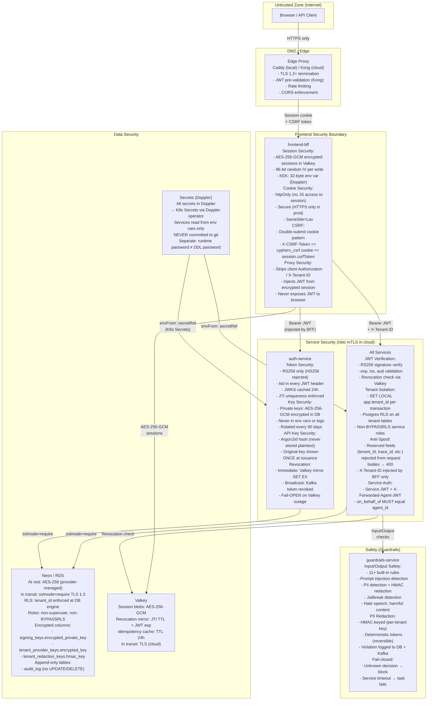

# Security Architecture Diagram

> Mermaid source. Shows trust boundaries, authentication layers, and data protection mechanisms.

```mermaid
graph TB
    subgraph "Untrusted Zone (Internet)"
        Browser2["Browser / API Client"]
    end

    subgraph "DMZ / Edge"
        Edge4["Edge Proxy\nCaddy (local) / Kong (cloud)\n- TLS 1.2+ termination\n- JWT pre-validation (Kong)\n- Rate limiting\n- CORS enforcement"]
    end

    subgraph "Frontend Security Boundary"
        BFF5["frontend-bff\nSession Security:\n- AES-256-GCM encrypted sessions in Valkey\n- 96-bit random IV per write\n- KEK: 32-byte env var (Doppler)\nCookie Security:\n- httpOnly (no JS access to session)\n- Secure (HTTPS only in prod)\n- SameSite=Lax\nCSRF:\n- Double-submit cookie pattern\n- X-CSRF-Token == cypherx_csrf cookie == session.csrfToken\nProxy Security:\n- Strips client Authorization / X-Tenant-ID\n- Injects JWT from encrypted session\n- Never exposes JWT to browser"]
    end

    subgraph "Service Security (Istio mTLS in cloud)"
        Auth5["auth-service\nToken Security:\n- RS256 only (HS256 rejected)\n- kid in every JWT header\n- JWKS cached 24h\n- JTI uniqueness enforced\nKey Security:\n- Private keys: AES-256-GCM encrypted in DB\n- Never in env vars or logs\n- Rotated every 90 days\nAPI Key Security:\n- Argon2id hash (never stored plaintext)\n- Original key shown ONCE at issuance\nRevocation:\n- Immediate: Valkey mirror SET EX\n- Broadcast: Kafka token.revoked\n- Fail-OPEN on Valkey outage"]

        Services2["All Services\nJWT Verification:\n- RS256 signature verify\n- exp, iss, aud validation\n- Revocation check via Valkey\nTenant Isolation:\n- SET LOCAL app.tenant_id per transaction\n- Postgres RLS on all tenant tables\n- Non-BYPASSRLS service roles\nAnti-Spoof:\n- Reserved fields (tenant_id, trace_id, etc.)\n  rejected from request bodies → 400\n- X-Tenant-ID injected by BFF only\nService Auth:\n- Service JWT + X-Forwarded-Agent-JWT\n- on_behalf_of MUST equal agent_id"]
    end

    subgraph "Data Security"
        Neon5["Neon / RDS\nAt rest: AES-256 (provider-managed)\nIn transit: sslmode=require TLS 1.3\nRLS: tenant_id enforced at DB engine\nRoles: non-superuser, non-BYPASSRLS\nEncrypted columns:\n- signing_keys.encrypted_private_key\n- tenant_provider_keys.encrypted_key\n- tenant_redaction_keys.hmac_key\nAppend-only tables:\n- audit_log (no UPDATE/DELETE)"]

        Valkey3["Valkey\nSession blobs: AES-256-GCM\nRevocation mirror: JTI TTL = JWT exp\nIdempotency cache: TTL 24h\nIn transit: TLS (cloud)"]

        Secrets["Secrets (Doppler)\nAll secrets in Doppler\n→ K8s Secrets via Doppler operator\nServices read from env vars only\nNEVER committed to git\nSeparate: runtime password ≠ DDL password"]
    end

    subgraph "Safety (Guardrails)"
        GR5["guardrails-service\nInput/Output Safety:\n- 11+ built-in rules\n- Prompt injection detection\n- PII detection + HMAC redaction\n- Jailbreak detection\n- Hate speech, harmful content\nPII Redaction:\n- HMAC-keyed (per-tenant key)\n- Deterministic tokens (reversible)\n- Violation logged to DB + Kafka\nFail-closed:\n- Unknown decision → block\n- Service timeout → task fails"]
    end

    Browser2 -->|"HTTPS only"| Edge4
    Edge4 -->|"Session cookie\n+ CSRF token"| BFF5
    BFF5 -->|"Bearer JWT\n(injected by BFF)"| Auth5
    BFF5 -->|"Bearer JWT\n+ X-Tenant-ID"| Services2
    Auth5 -->|"sslmode=require"| Neon5
    Services2 -->|"sslmode=require"| Neon5
    Services2 -->|"Revocation check"| Valkey3
    BFF5 -->|"AES-256-GCM\nsessions"| Valkey3
    Secrets -->|"envFrom: secretRef\n(K8s Secrets)"| Auth5
    Secrets -->|"envFrom: secretRef"| Services2
    Services2 -->|"Input/Output\nchecks"| GR5
```
