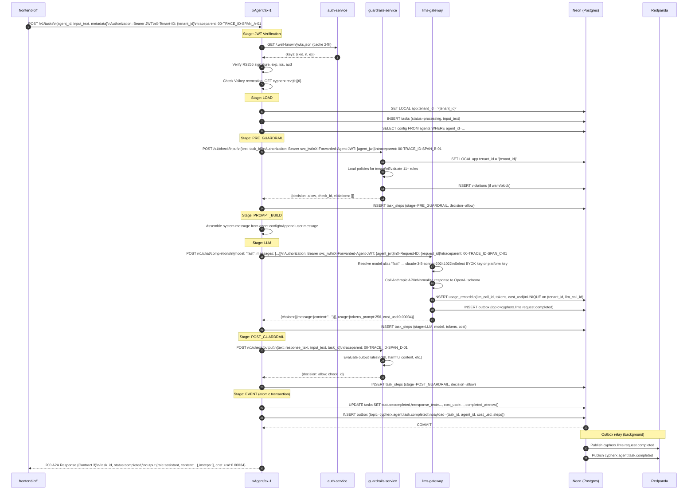

# Agent Task Execution — Sequence Diagram

> Mermaid source. Shows the complete task pipeline from BFF to response.

```mermaid
sequenceDiagram
    autonumber
    participant BFF as frontend-bff
    participant xA as xAgent/ax-1
    participant Auth as auth-service
    participant GR as guardrails-service
    participant LLM as llms-gateway
    participant DB as Neon (Postgres)
    participant Kafka as Redpanda

    BFF->>xA: POST /v1/tasks\n{agent_id, input_text, metadata}\nAuthorization: Bearer JWT\nX-Tenant-ID: {tenant_id}\ntraceparent: 00-TRACE_ID-SPAN_A-01

    Note over xA: Stage: JWT Verification
    xA->>Auth: GET /.well-known/jwks.json (cache 24h)
    Auth-->>xA: {keys: [{kid, n, e}]}
    xA->>xA: Verify RS256 signature, exp, iss, aud
    xA->>xA: Check Valkey revocation: GET cypherx:rev:jti:{jti}

    Note over xA: Stage: LOAD
    xA->>DB: SET LOCAL app.tenant_id = '{tenant_id}'
    xA->>DB: INSERT tasks (status=processing, input_text)
    xA->>DB: SELECT config FROM agents WHERE agent_id=...

    Note over xA: Stage: PRE_GUARDRAIL
    xA->>GR: POST /v1/check/input\n{text, task_id}\nAuthorization: Bearer svc_jwt\nX-Forwarded-Agent-JWT: {agent_jwt}\ntraceparent: 00-TRACE_ID-SPAN_B-01
    GR->>DB: SET LOCAL app.tenant_id = '{tenant_id}'
    GR->>GR: Load policies for tenant\nEvaluate 11+ rules
    GR->>DB: INSERT violations (if warn/block)
    GR-->>xA: {decision: allow, check_id, violations: []}
    xA->>DB: INSERT task_steps (stage=PRE_GUARDRAIL, decision=allow)

    Note over xA: Stage: PROMPT_BUILD
    xA->>xA: Assemble system message from agent config\nAppend user message

    Note over xA: Stage: LLM
    xA->>LLM: POST /v1/chat/completions\n{model: "fast", messages: [...]}\nAuthorization: Bearer svc_jwt\nX-Forwarded-Agent-JWT: {agent_jwt}\nX-Request-ID: {request_id}\ntraceparent: 00-TRACE_ID-SPAN_C-01
    LLM->>LLM: Resolve model alias "fast" → claude-3-5-sonnet-20241022\nSelect BYOK key or platform key
    LLM->>LLM: Call Anthropic API\nNormalize response to OpenAI schema
    LLM->>DB: INSERT usage_records\n(llm_call_id, tokens, cost_usd)\nUNIQUE on (tenant_id, llm_call_id)
    LLM->>DB: INSERT outbox (topic=cypherx.llms.request.completed)
    LLM-->>xA: {choices:[{message:{content:"..."}}], usage:{tokens_prompt:256, cost_usd:0.00034}}
    xA->>DB: INSERT task_steps (stage=LLM, model, tokens, cost)

    Note over xA: Stage: POST_GUARDRAIL
    xA->>GR: POST /v1/check/output\n{text: response_text, input_text, task_id}\ntraceparent: 00-TRACE_ID-SPAN_D-01
    GR->>GR: Evaluate output rules\n(PII, harmful content, etc.)
    GR-->>xA: {decision: allow, check_id}
    xA->>DB: INSERT task_steps (stage=POST_GUARDRAIL, decision=allow)

    Note over xA: Stage: EVENT (atomic transaction)
    xA->>DB: UPDATE tasks SET status=completed,\nresponse_text=..., cost_usd=..., completed_at=now()
    xA->>DB: INSERT outbox (topic=cypherx.agent.task.completed,\npayload={task_id, agent_id, cost_usd, steps})
    DB-->>xA: COMMIT

    Note over DB,Kafka: Outbox relay (background)
    DB->>Kafka: Publish cypherx.llms.request.completed
    DB->>Kafka: Publish cypherx.agent.task.completed

    xA-->>BFF: 200 A2A Response (Contract 3)\n{task_id, status:completed,\noutput:{role:assistant, content:...},\nsteps:[], cost_usd:0.00034}
```
