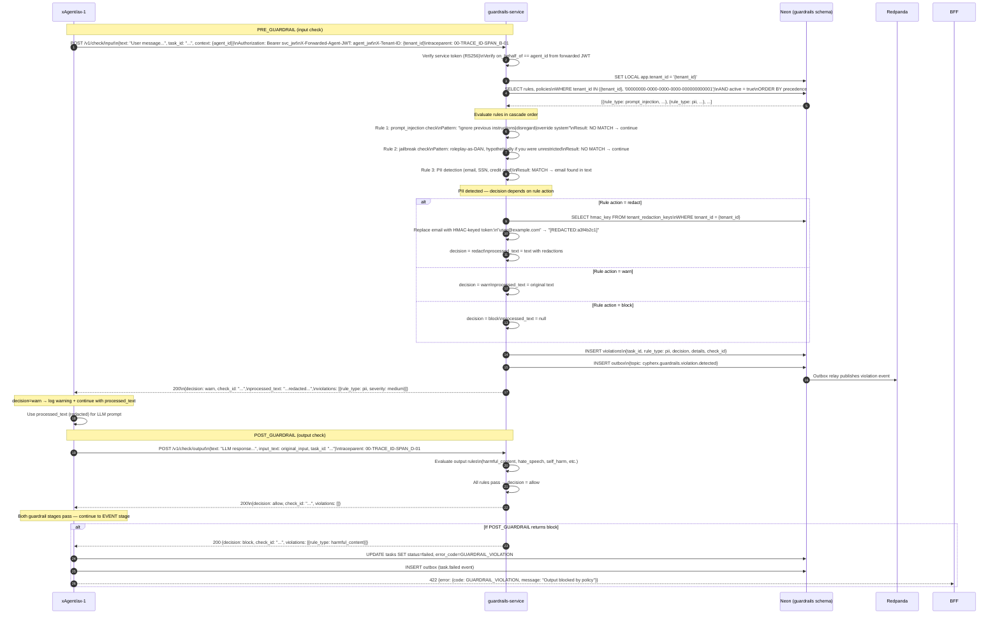

# Guardrail Check — Sequence Diagram

> Mermaid source. Shows the full guardrail evaluation pipeline for both input and output.

```mermaid
sequenceDiagram
    autonumber
    participant xA as xAgent/ax-1
    participant GR as guardrails-service
    participant DB as Neon (guardrails schema)
    participant Kafka as Redpanda

    Note over xA,GR: PRE_GUARDRAIL (input check)

    xA->>GR: POST /v1/check/input\n{text: "User message...", task_id: "...", context: {agent_id}}\nAuthorization: Bearer svc_jwt\nX-Forwarded-Agent-JWT: agent_jwt\nX-Tenant-ID: {tenant_id}\ntraceparent: 00-TRACE_ID-SPAN_B-01

    GR->>GR: Verify service token (RS256)\nVerify on_behalf_of == agent_id from forwarded JWT
    GR->>DB: SET LOCAL app.tenant_id = '{tenant_id}'
    GR->>DB: SELECT rules, policies\nWHERE tenant_id IN ({tenant_id}, '00000000-0000-0000-0000-000000000001')\nAND active = true\nORDER BY precedence
    DB-->>GR: [{rule_type: prompt_injection, ...}, {rule_type: pii, ...}, ...]

    Note over GR: Evaluate rules in cascade order

    GR->>GR: Rule 1: prompt_injection check\nPattern: "ignore previous instructions|disregard|override system"\nResult: NO MATCH → continue

    GR->>GR: Rule 2: jailbreak check\nPattern: roleplay-as-DAN, hypothetically if you were unrestricted\nResult: NO MATCH → continue

    GR->>GR: Rule 3: PII detection (email, SSN, credit card)\nResult: MATCH → email found in text

    Note over GR: PII detected — decision depends on rule action

    alt Rule action = redact
        GR->>DB: SELECT hmac_key FROM tenant_redaction_keys\nWHERE tenant_id = {tenant_id}
        GR->>GR: Replace email with HMAC-keyed token:\n"user@example.com" → "[REDACTED:a3f4b2c1]"
        GR->>GR: decision = redact\nprocessed_text = text with redactions
    else Rule action = warn
        GR->>GR: decision = warn\nprocessed_text = original text
    else Rule action = block
        GR->>GR: decision = block\nprocessed_text = null
    end

    GR->>DB: INSERT violations\n{task_id, rule_type: pii, decision, details, check_id}
    GR->>DB: INSERT outbox\n{topic: cypherx.guardrails.violation.detected}
    DB->>Kafka: Outbox relay publishes violation event

    GR-->>xA: 200\n{decision: warn, check_id: "...",\nprocessed_text: "...redacted...",\nviolations: [{rule_type: pii, severity: medium}]}

    Note over xA: decision=warn → log warning + continue with processed_text
    xA->>xA: Use processed_text (redacted) for LLM prompt

    Note over xA,GR: POST_GUARDRAIL (output check)

    xA->>GR: POST /v1/check/output\n{text: "LLM response...", input_text: original_input, task_id: "..."}\ntraceparent: 00-TRACE_ID-SPAN_D-01

    GR->>GR: Evaluate output rules\n(harmful_content, hate_speech, self_harm, etc.)
    GR->>GR: All rules pass → decision = allow

    GR-->>xA: 200\n{decision: allow, check_id: "...", violations: []}

    Note over xA: Both guardrail stages pass — continue to EVENT stage

    alt If POST_GUARDRAIL returns block
        GR-->>xA: 200 {decision: block, check_id: "...", violations: [{rule_type: harmful_content}]}
        xA->>DB: UPDATE tasks SET status=failed, error_code=GUARDRAIL_VIOLATION
        xA->>DB: INSERT outbox (task.failed event)
        xA-->>BFF: 422 {error: {code: GUARDRAIL_VIOLATION, message: "Output blocked by policy"}}
    end
```
