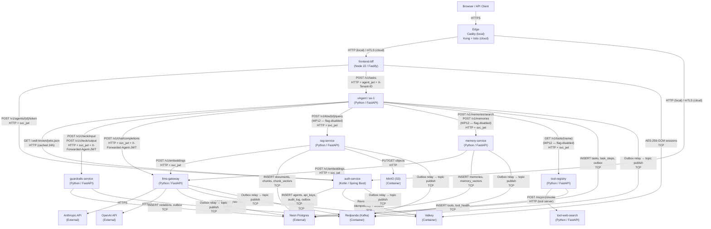

# Service Interaction Diagram

> Mermaid source. Shows all service-to-service call relationships with protocols.

```mermaid
graph TB
    Browser3["Browser / API Client"]
    Edge5["Edge\nCaddy (local)\nKong + Istio (cloud)"]
    BFF6["frontend-bff\n(Node 22 / Fastify)"]
    Auth6["auth-service\n(Kotlin / Spring Boot)"]
    xA5["xAgent / ax-1\n(Python / FastAPI)"]
    LLMs5["llms-gateway\n(Python / FastAPI)"]
    GR6["guardrails-service\n(Python / FastAPI)"]
    RAG5["rag-service\n(Python / FastAPI)"]
    Mem5["memory-service\n(Python / FastAPI)"]
    TR5["tool-registry\n(Python / FastAPI)"]
    TWS5["tool-web-search\n(Python / FastAPI)"]
    Anthropic5["Anthropic API\n(External)"]
    OpenAI5["OpenAI API\n(External)"]
    Neon5b["Neon Postgres\n(External)"]
    Redpanda5["Redpanda (Kafka)\n(Container)"]
    Valkey5["Valkey\n(Container)"]
    MinIO5["MinIO (S3)\n(Container)"]

    Browser3 -->|"HTTPS"| Edge5
    Edge5 -->|"HTTP (local) / mTLS (cloud)"| BFF6
    Edge5 -->|"HTTP (local) / mTLS (cloud)"| Auth6

    BFF6 -->|"POST /v1/agents/{id}/token\nHTTP + svc_jwt"| Auth6
    BFF6 -->|"POST /v1/tasks\nHTTP + agent_jwt + X-Tenant-ID"| xA5
    BFF6 -->|"AES-256-GCM sessions\nTCP"| Valkey5

    xA5 -->|"GET /.well-known/jwks.json\nHTTP (cached 24h)"| Auth6
    xA5 -->|"POST /v1/check/input\nPOST /v1/check/output\nHTTP + svc_jwt + X-Forwarded-Agent-JWT"| GR6
    xA5 -->|"POST /v1/chat/completions\nHTTP + svc_jwt + X-Forwarded-Agent-JWT"| LLMs5
    xA5 -->|"POST /v1/kbs/{id}/query\n(WP12 — flag-disabled)\nHTTP + svc_jwt"| RAG5
    xA5 -->|"POST /v1/memories/search\nPOST /v1/memories\n(WP12 — flag-disabled)\nHTTP + svc_jwt"| Mem5
    xA5 -->|"GET /v1/tools/{name}\n(WP12 — flag-disabled)\nHTTP + svc_jwt"| TR5
    xA5 -->|"INSERT tasks, task_steps, outbox\nTCP"| Neon5b
    xA5 -->|"Outbox relay → topic publish\nTCP"| Redpanda5

    TR5 -->|"POST /mcp/v1/invoke\nHTTP (tool server)"| TWS5
    TR5 -->|"INSERT tools, tool_health\nTCP"| Neon5b

    LLMs5 -->|"HTTPS"| Anthropic5
    LLMs5 -->|"HTTPS"| OpenAI5
    LLMs5 -->|"INSERT usage_records, outbox\nTCP"| Neon5b
    LLMs5 -->|"Idempotency cache\nTCP"| Valkey5
    LLMs5 -->|"Outbox relay → topic publish\nTCP"| Redpanda5

    GR6 -->|"INSERT violations, outbox\nTCP"| Neon5b
    GR6 -->|"Outbox relay → topic publish\nTCP"| Redpanda5

    RAG5 -->|"POST /v1/embeddings\nHTTP + svc_jwt"| LLMs5
    RAG5 -->|"INSERT documents, chunks, chunk_vectors\nTCP"| Neon5b
    RAG5 -->|"PUT/GET objects\nHTTP"| MinIO5
    RAG5 -->|"Outbox relay → topic publish\nTCP"| Redpanda5

    Mem5 -->|"POST /v1/embeddings\nHTTP + svc_jwt"| LLMs5
    Mem5 -->|"INSERT memories, memory_vectors\nTCP"| Neon5b
    Mem5 -->|"Outbox relay → topic publish\nTCP"| Redpanda5

    Auth6 -->|"INSERT agents, api_keys, audit_log, outbox\nTCP"| Neon5b
    Auth6 -->|"Revocation mirror\nIdempotency + session\nTCP"| Valkey5
    Auth6 -->|"Outbox relay → topic publish\nTCP"| Redpanda5
```
